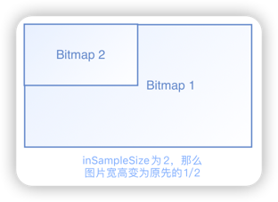

# Bitmap优化

### 1：减少单个像素的大小。

**inPreferredConfig**：图片解码后的**像素格式**。
> 1. ARGB_8888（8x4=32bit）
> 2. ARGB_4444（4x4=16bit） 
> 3. RGB_565（5+6+6=16bit）  
> 4. ALPHA_8（8bit）
***
### 2：减少像素的总数。
**inSampleSize**：设置图片的采样率进行缩放展示。

[查看代码](code/SampleFragment.kt)
***
### 3：为尽可能多的分辨率准备图片资源，并放入合适的mipmap文件夹下面
[不同dpi文件夹对Bitmap大小的影响](05.%20不同dpi文件夹对Bitmap大小的影响.md)
***
### 4：Bitmap内存复用。

[查看代码](code/BitmapReuseFragment.kt)
***
### 5：三级缓存。

