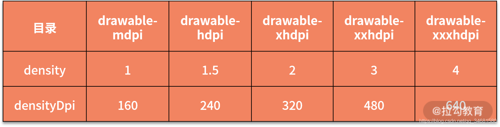

# 不同dpi文件夹对Bitmap大小的影响

## 场景展现

1. drawable-xhdpi下有一张600*600的图片test.png，将它加载到内存中，计算得出的内存占用大小：

> 600 * 600 * 4 = 1440000

2. 将test.png移到drawable-hdpi下，然后重新计算内存占用大小：

> 2560000

🤔：为什么同一张图片，在xhdpi和hdpi的文件夹下，所占内存会不一样？
***
## 原因揭秘

<font color=#dea32c>BitmapFactory在解析图片的过程中，会根据当前设备屏幕密度和图片所在的drawable目录来做一个对比，根据这个对比值进行缩放操作。
</font>

> 1、缩放比例scale = 当前设备屏幕密度 / 图片所在 drawable 目录对应屏幕密度
> 
> 2、Bitmap实际大小 = 宽 * scale * 高 * scale * 单像素所占字节大小

### 各个 drawable 目录对应的屏幕密度



当前设备是Nexus4，屏幕密度为320。

``` kotlin
// 获取densityDpi
// RedMi K50的DensityDpi是420。
Log.d("YXD", "densityDpi is "+resources.displayMetrics.densityDpi)
```

如果将 test.png 放到 drawable-hdpi 目录下，最终的计算公式如下：

> 实际占用内存大小 = 600 * (320 / 240) * 600 * (320 / 240) * 4 = 2560000

总结：<font color=#33a3dc>**如果将大屏手机的图片资源放到小屏手机上，图片会被放大**</font>。

> 💡：系统不会对assets目录下的图片进行缩放操作。

***

