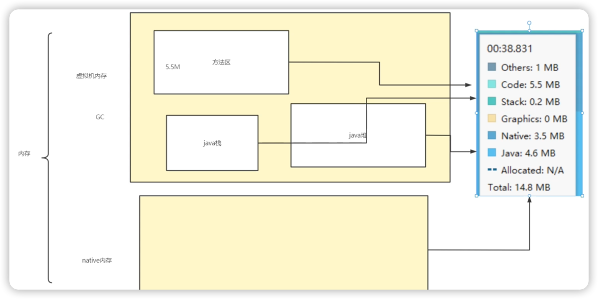

# Bitmap的内存分布和大小计算

## 内存分布

在Native内存(堆)区。

因此在使用Android Profiler分析Bitmap造成的内存问题时，分析Native部分即可。

> ####引申：内存与Profiler的对应关系
>
> 
>
> Graphics是OpenGl的内存。

***

## 大小计算


Bitmap所占内存大小 = 宽 x 高 x 单个像素所占大小(默认4字节)

> BitmapFactory默认使用ARGB_8888的存储方式来加载图片，即一个像素占4个字节。

### 获取所占内存大小
#### Bitmap.java
``` java
public final int getAllocationByteCount() {
    if (mRecycled) {
        // 如果Bitmap已被回收，则返回0
        return 0;
    }
    return nativeGetAllocationByteCount(mNativePtr);
}
```

