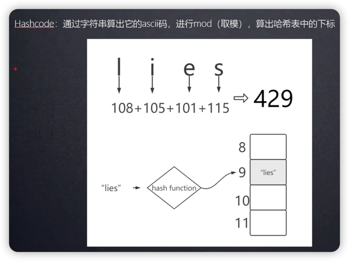
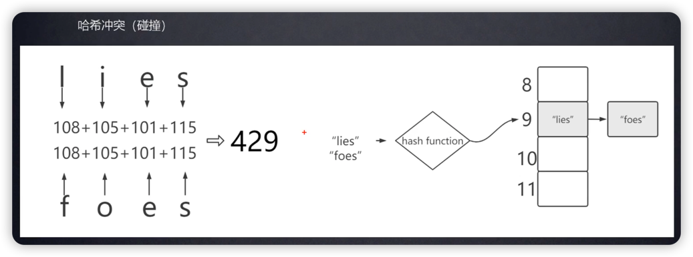

# hash算法与hash冲突

## Hash算法

1. 任意长度转固定长度
2. 转换不可逆

 

## Hash冲突
通过Hashcode计算出数组下标，下标可能相同。

使用链表解决Hash冲突

#### 其它hash冲突解决方法
> SparseArray：折半插入
> 
> ......

#### 🤔 Entry为何要传入hash变量？

> 若hashcode不一致，则key必不一致，效率。

***

