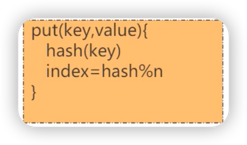
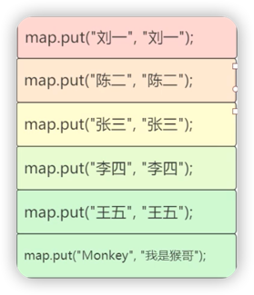
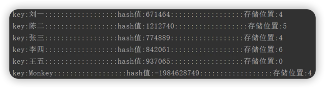
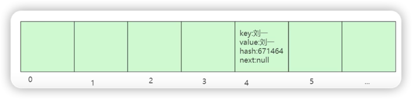
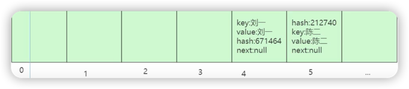
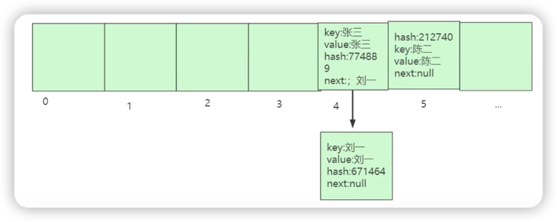
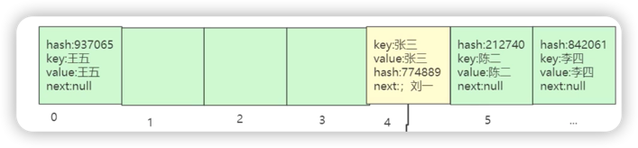
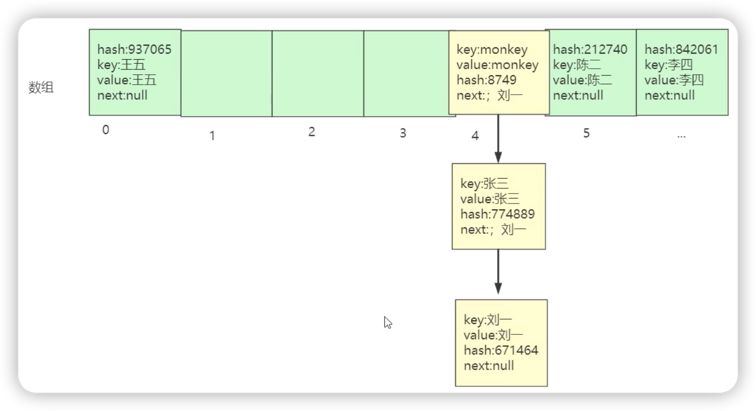

# Put流程

### 核心步骤
1. 计算key的hash值。
2. 给hash值取模。

***

### 放入数据

1. 准备数据  

2. 放入Entry"刘一：

3. 放入Entry"陈二"

4. 放入Entry"张三"

> 刘一的位置让给了张三，且张三指向了刘一

5. 放入Entry"王五"和"李四"

6. 放入Entry"猴哥"

***
# Get流程

1. 首先根据key计算出数组下标
2. 比较key的值，如果不相同，则继续往下找