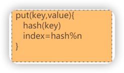
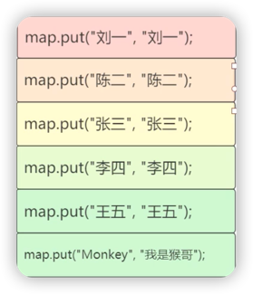
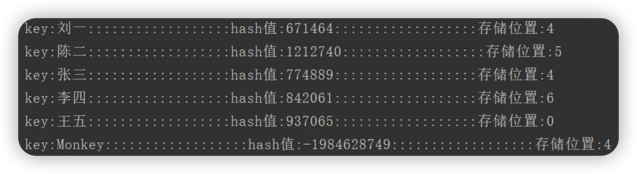
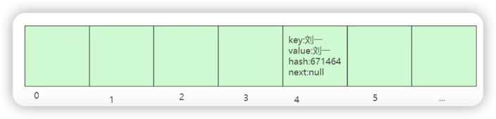
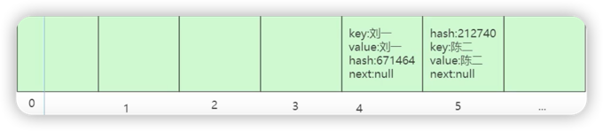
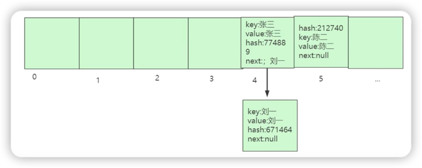
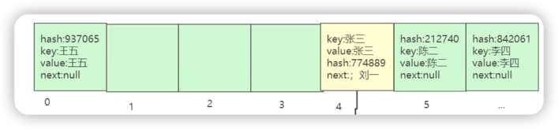
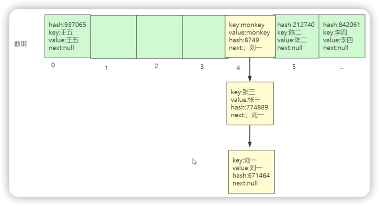
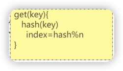

# PUT流程

### 创建HashMap
jdk8之前，内部创建了长度为**16**的叫**table**的**键值对数组**。（初始容量为16）

jdk8以后，在首次put时才会创建。

***

### 放入数据

1. 准备数据  

   

2. 放入Entry"刘一：

3. 放入Entry"陈二"

4. 放入Entry"张三"

> 刘一的位置让给了张三，且张三指向了刘一

5. 放入Entry"王五"和"李四"

6. 放入Entry"猴哥"

***
# Get流程

1. 首先根据key计算出数组下标
2. 比较key的值，如果不相同，则继续往下找