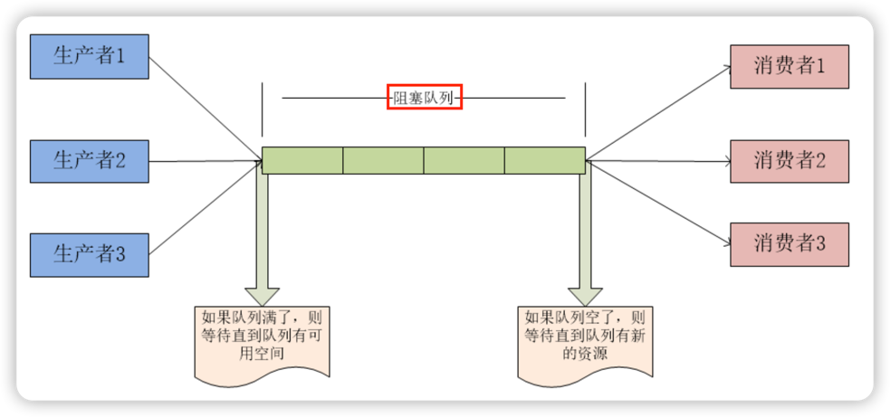

# 简介

BlockingQueue即阻塞队列，基于ReentrantLock，属于接口。

## 实现类
ArrayBlockingQueue、DelayQueue、 LinkedBlockingDeque、 LinkedBlockingQueue、PriorityBlockingQueue、 SynchronousQueue等。

它们的区别主要体现在存储结构上或对元素 操作上的不同，但是对于take与put操作的原理，却是类似的。

## 生产者与消费者模式

