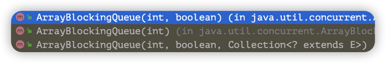

# ArrayBlockingQueue

数组阻塞队列

1. 创建时必须指定数组容量，且没有扩容机制。
   
2. 入队与出队都用同一把锁（入入互斥，出入互斥）。
   > 1. 两个线程不能同时执行入队
   > 2. 两个线程不能同时执行出队
   > 3. 当一个线程正在入队时，另一个线程不能执行出队
   > 4. 当一个线程正在出队时，另一个线程不能执行入队
3. 两个Condition，一个控制入队，一个控制出队。
4. 入队的元素会放在队列的尾部。

``` java
public ArrayBlockingQueue(int capacity, boolean fair) {
    if (capacity <= 0)
        throw new IllegalArgumentException();
    this.items = new Object[capacity];
    // 用于实现等待唤醒机制（阻塞）的锁
    // 因为Condition的等待唤醒方法必须在获取到ReentrantLock后才能调用
    lock = new ReentrantLock(fair);
    // 用于保证出队时，队列不空，空则阻塞，等不空时再执行出队
    notEmpty = lock.newCondition();
    // 用于保证入队时，队列不满，满则阻塞，等不满时则执行入队
    notFull =  lock.newCondition();
}
```

## put/take和enqueue/dequeue的区别
put：请求入队，不一定成功（队列满了）。

take：请求出队，不一定成功（队列空了）。

enqueue：执行入队。

dequeue：执行出队。

## notEmpty的作用

用于保证执行出队时，队列不为空。

``` java
// 请求出队
public E take() throws InterruptedException {
    final ReentrantLock lock = this.lock;
    lock.lockInterruptibly();
    try {
        while (count == 0){
            // 如果数组元素为0，则阻塞当前线程的出队操作
            notEmpty.await();
        }
        return dequeue();
    } finally {
        lock.unlock();
    }
}

// 执行入队
private void enqueue(E x) {
    final Object[] items = this.items;
    items[putIndex] = x;
    if (++putIndex == items.length) putIndex = 0;
    count++;
    // 当有新元素入队时，唤醒要执行出队操作的线程，并执行出队
    notEmpty.signal();
}
```

## notFull的作用
用于保证执行入队时，队列没有满。

> #### 小剧场《小王上网》
> 
> 角色
> 1. 小王 - 数组元素
> 2. 队列 - 网吧（里面有固定30台电脑）
> 3. notFull - 网管
> 
> 剧情
> 1. 小王进入网吧，找网管要上机卡。// 请求入队
> 2. 网管发现网吧已经满员了，又看到10分钟后有位顾客要下机了。
> 3. 网管劝小王等个10分钟。 // notFull.await()
> 4. 10分钟后，有位顾客下机了。// 出队
> 5. 网管通知小王可以去上网了。 // notFull.signal()
> 6. 小王拿到上机卡，打起了游戏。// 入队

``` java
// 请求入队
public void put(E e) throws InterruptedException {
    Objects.requireNonNull(e);
    final ReentrantLock lock = this.lock;
    lock.lockInterruptibly();
    try {
        while (count == items.length){
            // 如果当前队列已经满了，则阻塞当前线程
            notFull.await();
        }
        enqueue(e);
    } finally {
        lock.unlock();
    }
}

// 执行出队
private E dequeue() {
    final Object[] items = this.items;
    @SuppressWarnings("unchecked")
    E x = (E) items[takeIndex];
    items[takeIndex] = null;
    if (++takeIndex == items.length) takeIndex = 0;
    count--;
    if (itrs != null)
        itrs.elementDequeued();
    // 当有元素出队后，唤醒阻塞的线程，执行入队。
    notFull.signal();
    return x;
}
```
