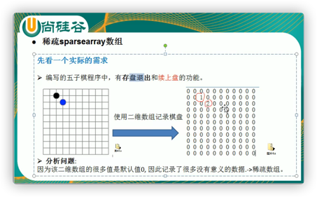
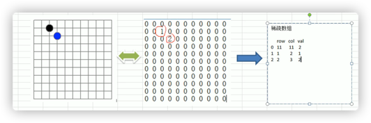

***
## 稀疏数组
    当一个数组中大部分元素为0时，或者为同一个值的数组时，可以使用稀疏数组来保存。

### 处理方法
* 记录数组共有几行几列，有多少个不同的值。 
* 把不同值的元素值和位置存放在一个小数组中。

***
## 数组转换

## 转回原始数组思路
1. 读取稀疏数组的第一行，创建一个原始的二维数组。
2. 读取稀疏数组后几行的数据，赋值给这个二维数组。

[B站](https://www.bilibili.com)