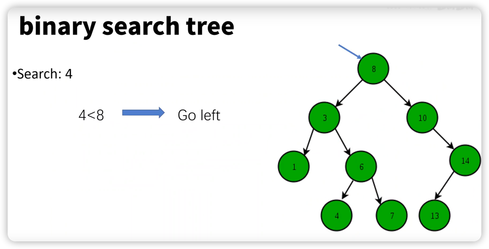
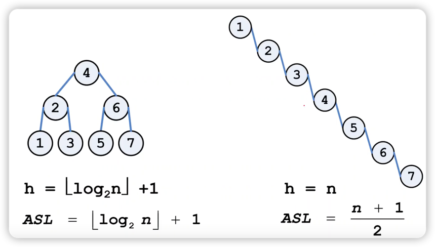
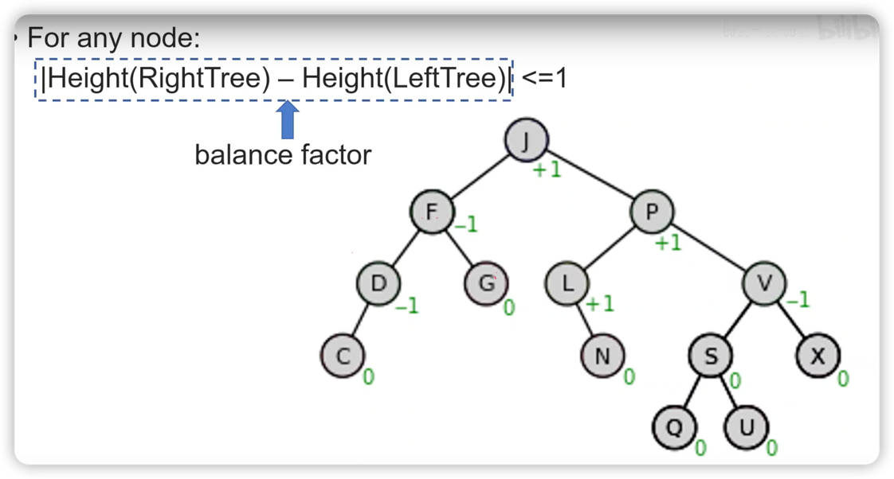

## 二叉树

### 结构特征
**左小右大**

每个节点下有0-2个节点，左节点的数小于自身，右节点的数大于自身。

* 查询过程：从树根查到树叶。
* 最大查询次数：树的高度。

***

### 树的平衡性

左右越平衡，查找效率就越高。

***

### 平衡二叉树 AVL tree
对于任意节点， **平衡因子**(左树的高度 与 右树的高度 之差) <= 1

> #### 分析
> 对于J节点来说，右树高度要比左树高度大1，因此平衡因子为+1
> 
> 对于F节点来说，左树高度要比右树高度小1，因此平衡因子为-1
> 
> 对于S节点来说，左树高度与右树高度相同，因此平衡因子为0
> 
> 对于叶节点来说，其平衡因子均为是0
> 
要把一串数字变为平衡二叉树，插入和删除的算法就会变得很复杂。

### 二叉树的失衡

> 举例：二叉树在插入过程中失衡
> 
> **12 -> 24 -> 37**
> 
> 此时12的平衡因子为2，已经超出了1，因此不再平衡。
> 
🤔 如何处理这种失衡的情况？
> 将12旋转到24的左边(**左旋**)
> 
> **12 <- 24** -> 37
> 
> 这样每个节点的平衡因子就都为0了
> 
总的来说，二叉树的失衡有四种情况
1. LL：节点左侧的左树失衡。
2. LR：节点左侧的右树失衡。
3. RL：节点右侧的左树失衡。
4. RR：节点右侧的右树失衡。

