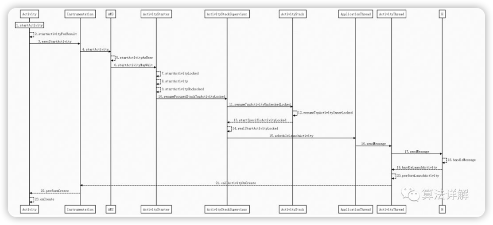

# 概述

在Activity A 打开Activity B

可以拆解成三部分，逐一突破

startActivity → AMS → AT → Activity

> 1. startActivity → ActivityManagerService
> 2. ActivityManagerService → ApplicationThread
> 3. ApplicationThread → Activity

### 总时序图
Activity → Instrumentation → AMS → ActivityStarter
→ ActivityStackSupervisor（监督者、管理者） → ActivityStack → ApplicationThread
→ ActivityThread

