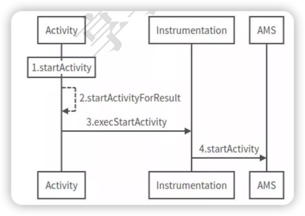

# startActivity → AMS



记忆
1. Activity（startActivity、startActivityForResult）
2. Instrumentation（execStartActivity）
3. AMS（startActivity）

### 一、startActivity内调startActivityForResult
``` java
@Override
public void startActivity(Intent intent, @Nullable Bundle options) {
    if (options != null) {
        //第二个参数为-1，表示不需要知道Activity启动的结果
        startActivityForResult(intent, -1, options);
    } else {
        startActivityForResult(intent, -1);
    }
}
```

### 二、startActivityForResult内调Instrumentation.execStartActivity
``` java
public void startActivityForResult(@RequiresPermission Intent intent, int requestCode, @Nullable Bundle options)
{
    // 调用Instrumentation.execStartActivity()，启动新的Activity
    
    // mMainThread类型为ActivityThread（可以理解为A进程）, 在attach()时被赋值。
    // ApplicationThread的引用可以用来实现IPC
    Instrumentation.ActivityResult ar = 
        mInstrumentation.execStartActivity(this, mMainThread.getApplicationThread(), mToken, this, intent, requestCode, options);
}
```
> Instrumentation（仪器）：监控APP与System交互。

### 三、Instrumentation的execStartActivity
``` java
public ActivityResult execStartActivity(
    Context who, 
    IBinder contextThread, 
    IBinder token, 
    Activity target,
    Intent intent, 
    int requestCode, 
    Bundle options) 
{
    // ...
    // 实际上这里是通过AIDL来调用AMS的startActivity方法
    int result = ActivityManager.getService().startActivity(...);
    // 检查startActivity的结果
    checkStartActivityResult(result, intent);
}
```
