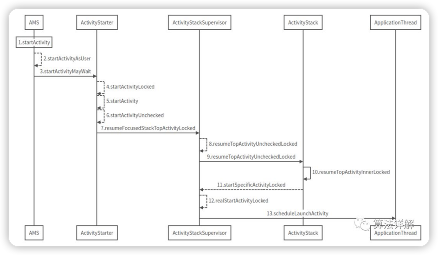
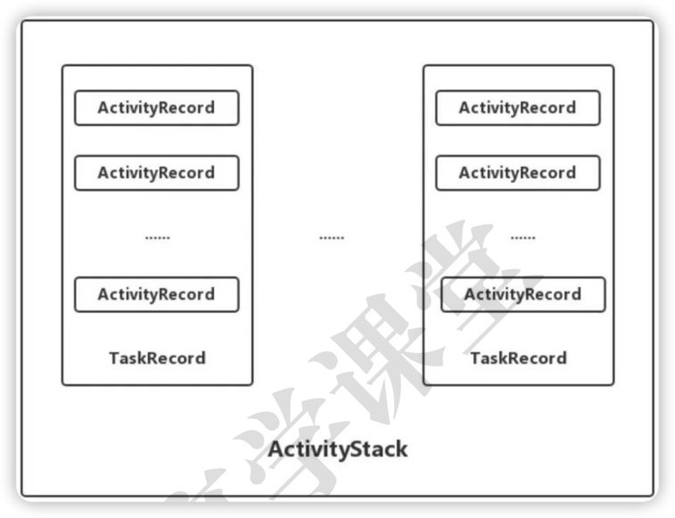
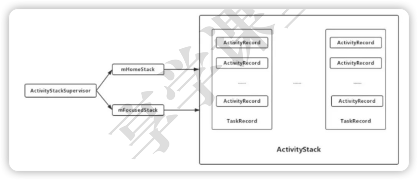

#  AMS → ApplicationThread
AMS最终其实就是调用了B进程的ApplicationThread引用，从而间接的通知B进程进行相应操作。



> 看似比 sA → AMS 复杂的多，其实只干了两件事
>
> ①：处理Flag（启动模式和Intent），生成目标Activity（ActivityRecord）。
>
> ②：判断是否需要为目标Activity生成新进程（ProcessRecord）和新任务栈（TaskRecord）。

***
### 名词学习

#### ActivityRecord
1. 对应一个Activity，保存了一个Activity的所有信息。
2. 一个Activity可能会有多个ActivityRecord, 因为Activity可以被多次启动，这个主要取决于其启动模式。
3. 成员变量task表示其所在的TaskRecord（任务栈）。
4. startActivity()时会创建一个ActivityRecord。

#### TaskRecord
1. 由1~N个ActivityRecord组成，表示任务栈，具有后进先出的特点。
2. 内部维护一个ArrayList<ActivityRecord>用来保存ActivityRecord。
3. 成员变量mStack表示其所在的ActivityStack。
4. startActivity()时也会创建一个TaskRecord：

#### ActivityStack
1. 管理TaskRecord，包含了1~N个TaskRecord。
2. 内部维护了一个ArrayList<TaskRecord>，用来管理TaskRecord。
3. 由ActivityStackSupervisor来创建和管理。

#### ActivityStack、TaskRecord、ActivityRecord关系图



#### ActivityStackSupervisor
``` java
public class ActivityStackSupervisor extends ConfigurationContainer implements DisplayListener {
    // 管理的是Launcher相关的任务
    ActivityStack mHomeStack;
    
    // 管理非Launcher相关的任务
    ActivityStack mFocusedStack;
    
    // 创建ActivityStack
    ActivityStack createStack(
        int stackId,
        ActivityStackSupervisor.ActivityDisplay display, 
        boolean onTop) 
    {
        switch (stackId) {
            case PINNED_STACK_ID:
                // PinnedActivityStack是ActivityStack的子类
                return new PinnedActivityStack(
                    display, 
                    stackId, 
                    this, 
                    mRecentTasks,
                    onTop);
            default:
                // 创建一个ActivityStack
                return new ActivityStack(display, stackId, this, mRecentTasks, onTop);
        }
    }
}
```

AMS初始化时会创建一个ActivityStackSupervisor对象

``` java
public ActivityManagerService()
{
    mStackSupervisor = createStackSupervisor();
}

protected ActivityStackSupervisor createStackSupervisor()
{
    return new ActivityStackSupervisor(this, mHandler.getLooper());
}
```

#### 总结



***

### AMS的startActivity

``` java
@Override
public final int startActivity(IApplicationThread caller, String callingPackage,
    Intent intent, String resolvedType, IBinder
    resultTo, String resultWho, int requestCode,
    int startFlags, ProfilerInfo profilerInfo,
    Bundle bOptions) {
    // 就是调用了startActivityAsUser
    return startActivityAsUser(caller,
        callingPackage, intent, resolvedType, resultTo,
        resultWho, requestCode, startFlags,
        profilerInfo, bOptions,
        UserHandle.getCallingUserId());
}
```

### AMS的startActivityAsUser
检查当前调用者是否有权限，然后交给ActivityStarter操作
``` java
mActivityStarter.startActivityMayWait(...)
```

### ActivityStarter的startActivityMayWait

ActivityStarter：Activity启动器（解析Intent、创建ActivityRecord、TaskRecord）

startActivityMayWait最终会调用到startActivityUnchecked()

``` java
private int startActivityUnchecked(
    final ActivityRecord r, 
    ActivityRecord sourceRecord,
    IVoiceInteractionSession voiceSession,
    IVoiceInteractor voiceInteractor,
    int startFlags, 
    boolean doResume,
    ActivityOptions options, 
    TaskRecord inTask) 
{   
    // 初始化启动Activity的各种配置，
    // 在初始化前会重置各种配置再进行配置，
    // 这些配置包括：ActivityRecord、Intent、TaskRecord和LaunchFlags（启动的FLAG）等等。
    setInitialState(r, options, inTask, doResume, startFlags, sourceRecord, voiceSession, voiceInteractor);
    // 用于计算出启动的FLAG，并将计算的值赋值给mLaunchFlags
    computeLaunchingTaskFlags();
    computeSourceStack();
    // 将mLaunchFlags设置给Intent，达到设定Activity的启动方式的目的
    mIntent.setFlags(mLaunchFlags);
    ...
    // 最终调用
    mSupervisor.resumeFocusedStackTopActivityLocked(mTargetStack, mStartActivity, mOptions);
}
```

### ActivityStackSupervisor的resumeFocusedStackTopActivityLocked
恢复聚焦栈顶Activity锁定。
``` java
boolean resumeFocusedStackTopActivityLocked(
    ActivityStack targetStack, ActivityRecord
    target, ActivityOptions targetOptions) {
    //...
    if (targetStack != null &&
    isFocusedStack(targetStack)) {
    return targetStack.resumeTopActivityUncheckedLocked(target, targetOptions);
    //...
}
```

### ActivityStack的resumeTopActivityUncheckedLocked
恢复顶Activity未检查锁定
``` java
boolean resumeTopActivityUncheckedLocked(ActivityRecord
    prev, ActivityOptions options) 
{
    if (mStackSupervisor.inResumeTopActivity) {
        // Don't even start recursing.
        return false;
    }
    boolean result = false;
    try {
        // Protect against recursion.
        mStackSupervisor.inResumeTopActivity = true;
        
        // 关键
        result = resumeTopActivityInnerLocked(prev, options);
    } finally {
        mStackSupervisor.inResumeTopActivity = false;
    }
    //...
    return result;
}
```
### ActivityStack的resumeTopActivityInnerLocked
恢复顶Activity内部锁定
``` java
private boolean resumeTopActivityInnerLocked(
    ActivityRecord prev,
    ActivityOptions options) 
{
    // ...
    if (mResumedActivity != null) {
        if (DEBUG_STATES) 
            Slog.d(TAG_STATES, "resumeTopActivityLocked: Pausing " + mResumedActivity);
        // 暂停当前activity，调用Activity的onPause
        pausing |= startPausingLocked(userLeaving, false, next, false);
    }
    // ...
    // 启动新activity
    mStackSupervisor.startSpecificActivityLocked(next, true, true);
    // ...
}
```
### ActivityStackSupervisor的startSpecificActivityLocked
启动指定Activity锁定
``` java
/**
 * 判断系统Activity B进程(ProcessRecord)是否正在运行？
 * YES：继续执行realStartActivityLocked方法，
 * NO：调用AMS的startProcessLocked方法创建进程。
 */
void startSpecificActivityLocked(
    ActivityRecord r,boolean andResume, boolean checkConfig) {
    
    ProcessRecord app = mService.getProcessRecordLocked(r.processName, r.info.applicationInfo.uid, true);//获取
    ProcessRecord r.getStack().setLaunchTime(r);
    if (app != null && app.thread != null) {
        try {
            if((r.info.flags&ActivityInfo.FLAG_MULTIPROCESS) == 0
            ||
            !"android".equals(r.info.packageName)) {
                app.addPackage(
                    r.info.packageName,
                    r.info.applicationInfo.versionCode,
                    mService.mProcessStats
                );
            }
            realStartActivityLocked(r, app, andResume, checkConfig);
            return;
        } catch (RemoteException e) {
            Slog.w(TAG, "Exception when starting
            activity "
            +
            r.intent.getComponent().flattenToShortString(), e);
        }
    }
    // 创建新的ProcessRecord
    mService.startProcessLocked(
        r.processName,
        r.info.applicationInfo, 
        true, 
        0,
        "activity", 
        r.intent.getComponent(),
        false, false, true);
}
```

### ActivityStackSupervisor的realStartActivityLocked
真实启动Activity锁定
``` java
final boolean realStartActivityLocked(
    ActivityRecord r,
    ProcessRecord app,
    boolean andResume, 
    boolean checkConfig) throws RemoteException 
{
    //...
    
    // app是ProcessRecord类型，代表一个进程记录，在这就是B进程
    // app.thread是ApplicationThread类型，通过它实现进程间通信
    
    // 通知B进程中的ApplicationThread执行scheduleLaunchActivity方法，
    // 至此重心就离开系统AMS进程，剩下事都是在B进程中执行了。
    app.thread.scheduleLaunchActivity(
        new Intent(r.intent), 
        r.appToken,
        System.identityHashCode(r), 
        r.info,
        mergedConfiguration.getGlobalConfiguration(),
        mergedConfiguration.getOverrideConfiguration(), 
        r.compat,
        r.launchedFromPackage,
        task.voiceInteractor, 
        app.repProcState, 
        r.icicle,
        r.persistentState, 
        results, 
        newIntents,
        !andResume,
        mService.isNextTransitionForward(),
        profilerInfo);
    //...
}
```
