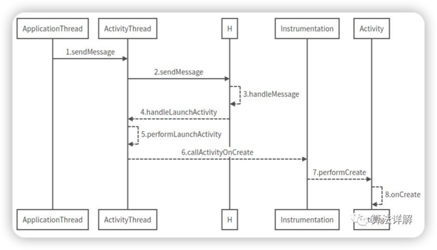

# ApplicationThread→Activity



### ApplicationThread的scheduleLaunchActivity

``` java
// ApplicationThread是ActivityThread的内部类
app.thread.scheduleLaunchActivity(...)
```

``` java
/**
 * scheduleLaunchActivity中就是将启动Activity的参数封装成
 * ActivityClientRecord，然后调用ActivityThread的sendMessage方法。
 */
@Override
public final void scheduleLaunchActivity(
    Intent intent, 
    IBinder token, 
    int ident,
    ActivityInfo info, 
    Configuration curConfig, 
    Configuration overrideConfig,
    CompatibilityInfo compatInfo, 
    String referrer, 
    IVoiceInteractor voiceInteractor,
    int procState, 
    Bundle state,
    PersistableBundle persistentState,
    List<ResultInfo> pendingResults,
    List<ReferrerIntent> pendingNewIntents,
    boolean notResumed, 
    boolean isForward,
    ProfilerInfo profilerInfo) 
{
    updateProcessState(procState, false);
    ActivityClientRecord r = new ActivityClientRecord();
    r.token = token;
    r.ident = ident;
    r.intent = intent;
    r.referrer = referrer;
    r.voiceInteractor = voiceInteractor;
    r.activityInfo = info;
    r.compatInfo = compatInfo;
    r.state = state;
    r.persistentState = persistentState;
    r.pendingResults = pendingResults;
    r.pendingIntents = pendingNewIntents;
    r.startsNotResumed = notResumed;
    r.isForward = isForward;
    r.profilerInfo = profilerInfo;
    r.overrideConfig = overrideConfig;
    updatePendingConfiguration(curConfig);
    // 调用ActivityThread的sendMessage方法，发送LAUNCH_ACTIVITY信息
    sendMessage(H.LAUNCH_ACTIVITY, r);
}
```
ApplicationThread的sendMessage
``` java
private void sendMessage(int what, Object obj) {
    sendMessage(what, obj, 0, 0, false);
}

private void sendMessage(int what, Object obj, 
    int arg1, int arg2, boolean async) {
    
    if (DEBUG_MESSAGES) 
        Slog.v(TAG, "SCHEDULE " + what + " " +mH.codeToString(what) + ": " + arg1 + " / " + obj);
    
    Message msg = Message.obtain();
    msg.what = what;
    msg.obj = obj;
    msg.arg1 = arg1;
    msg.arg2 = arg2;
    if (async) {
        msg.setAsynchronous(true);
    }
    // H是ActivityThread的一个内部类
    // 会对各种状态进行处理。
    mH.sendMessage(msg);
}
```

***

### H.handleLaunchActivity
``` java
private class H extends Handler { 
    switch (msg.what) {
        case LAUNCH_ACTIVITY: {// 启动ACTIVITY
            Trace.traceBegin(Trace.TRACE_TAG_ACTIVITY_MANAGER, "activityStart");
            final ActivityClientRecord r =
            (ActivityClientRecord) msg.obj;
            r.packageInfo =
            getPackageInfoNoCheck(
            r.activityInfo.applicationInfo, r.compatInfo);
            // 关键
            // 该方法最终调用了Instrumentation的callActivityOnCreate方法，
            handleLaunchActivity(r, null, "LAUNCH_ACTIVITY");
        }
    }
}
```
***
### Instrumentation的callActivityOnCreate
``` java
public void callActivityOnCreate(
    Activity activity,
    Bundle icicle,
    PersistableBundle persistentState) 
{
    prePerformCreate(activity);
    activity.performCreate(icicle, persistentState);
    postPerformCreate(activity);
}
```
***
### Activity的performCreate
``` java
final void performCreate(Bundle icicle) {
    performCreate(icicle, null);
}

final void performCreate(
    Bundle icicle,
    PersistableBundle persistentState) 
{
    mCanEnterPictureInPicture = true;
    restoreHasCurrentPermissionRequest(icicle);
    // 可以看到，onCreate被调用起来了。至此，Activity被启动起来了
    if (persistentState != null) {
        onCreate(icicle, persistentState);//onCreate
    } else {
        onCreate(icicle);//onCreate
    }
    mActivityTransitionState.readState(icicle);
    mVisibleFromClient =
    !mWindow.getWindowStyle().getBoolean(
        com.android.internal.R.styleable.Window_windowNoDisplay,
        false
    );
    mFragments.dispatchActivityCreated();
    mActivityTransitionState.setEnterActivityOptions(
        this, getActivityOptions());
}    
```

