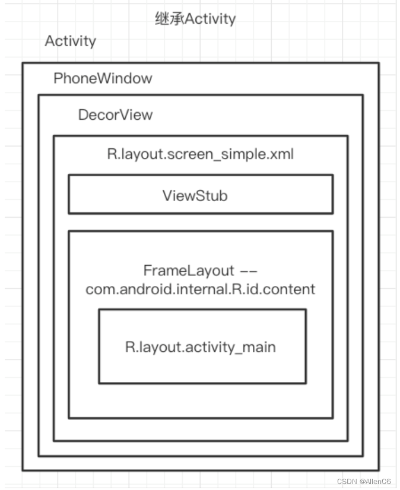

# setContentView流程解析

#### Activity.java
``` java
public void setContentView(@LayoutRes int layoutResID) {
    // Window只有一个实现类PhoneWindow
    getWindow().setContentView(layoutResID);
    // ...
}
```

#### PhoneWindow.java

mContentParent: 

``` java

// 这是窗口的顶层视图，包含窗口装饰。
private DecorView mDecor;

// 放置窗口内容的视图。它要么是mDecor本身，要么是mDecor的子节点。
ViewGroup mContentParent;

@Override
public void setContentView(int layoutResID) {
    
    // 初始化contetView的父容器
    if (mContentParent == null) {
        installDecor();
    } else if (!hasFeature(FEATURE_CONTENT_TRANSITIONS)) {
        // 如果多次setContentView会移除掉之前的布局
        mContentParent.removeAllViews();
    }
    
    // 加载布局内容
    if (hasFeature(FEATURE_CONTENT_TRANSITIONS)) {
        final Scene newScene = Scene.getSceneForLayout(mContentParent, layoutResID,
                getContext());
        transitionTo(newScene);
    } else {
        // 渲染布局
        mLayoutInflater.inflate(layoutResID, mContentParent);
    }
    mContentParent.requestApplyInsets();
    
    // 加载完成之后通知回调
    final Callback cb = getCallback();
    if (cb != null && !isDestroyed()) {
        cb.onContentChanged();
    }
    mContentParentExplicitlySet = true;
}
```

## installDecor()
初始化DecorView。
 
``` java
if (mDecor == null) {
    // 初始化mDecor
    mDecor = generateDecor(-1);
    // ...
} else {
    mDecor.setWindow(this);
}
if (mContentParent == null) {
    // 初始化mContentParent
    mContentParent = generateLayout(mDecor);
    // ...
}
// ...
```

[分析generateDecor](doc/generateDecor.md)

[分析generateLayout](doc/generateLayout.md)

## mLayoutInflater.inflate(...)

``` java
mLayoutInflater.inflate(layoutResID, mContentParent);
```

渲染Activity的布局文件到ContentParent中。


