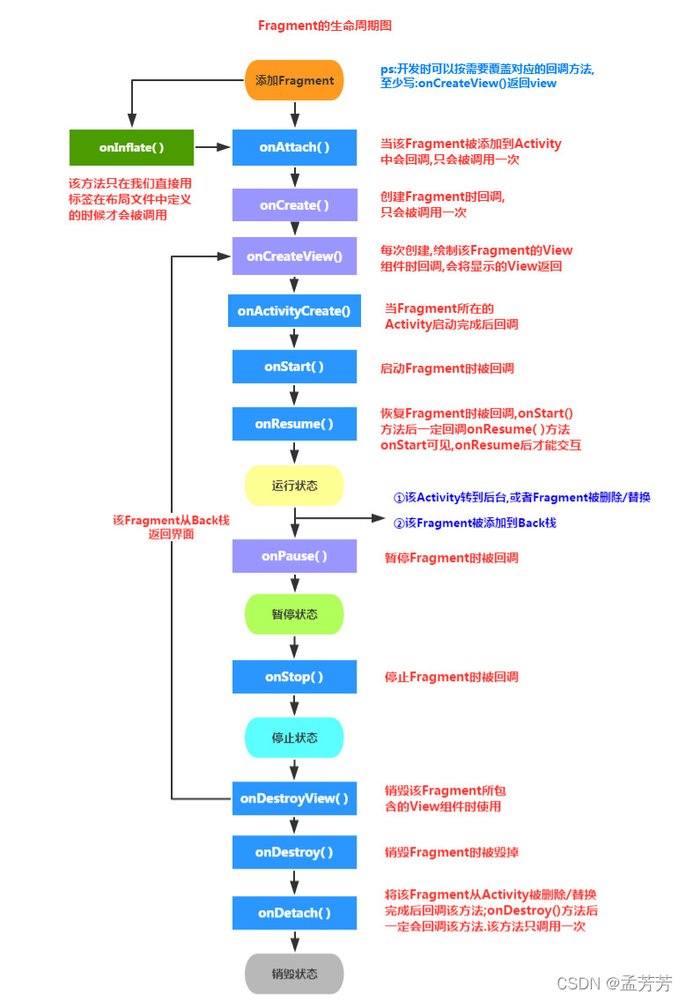

# Fragment生命周期

## 常见周期流程

1. Activity加载Fragment的时候，依次调用：onAttach() -> onCreate() -> onCreateView() -> onActivityCreated() -> onStart() ->onResume()

2. 当做出一个悬浮的对话框风格的Activity，或者其他，就是让Fragment所在的Activity可见,但不获得焦点：onPause()

3. 当对话框关闭，Activity又获得了焦点： onResume()

4. 当替换Fragment，并调用addToBackStack()将它添加到Back栈中：onPause() -> onStop() -> onDestoryView() 。注意，此时的Fragment还没有被销毁哦。

5. 当按下键盘的回退键，Fragment会再次显示出来：onCreateView() -> onActivityCreated() -> onStart() -> onResume()

6. 如果替换后，在事务commit之前没有调用addToBackStack()方法将Fragment添加到back栈中，或者退出了Activity的话，那么Fragment将会被完全结束，Fragment会进入销毁状态： onPause() -> onStop() -> onDestoryView() -> onDestory() -> onDetach()