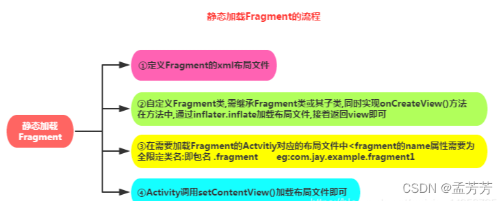
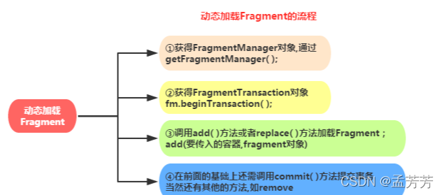

# Fragment创建

## 静态加载
以<fragment>标签的形式添加到Activity的布局当中。

## 动态加载

通过java代码将fragment添加到已存在的宿主Activity中。

### FragmentManager
管理Activity中的fragment，通过getSupportFragmentManager获取。
#### 常用方法
1. findFragmentById()：获取指定的Fragment。
2. popBackStack()：将Fragment出栈。
3. addToBackStack()：将Fragment加入回退栈。
4. addOnBackStackChangeListener()：监听后台栈的变化。
5. beginTransaction()：返回一个Fragment事务。
6. ......

### FragmentTransaction
Fragment事务，用来添加、移除、替换fragment，在操作完后需要用commit()提交事务。

>获取事务：transaction = fm.beginTransaction()。

#### 常用方法
1. add()：往Activity中添加一个Fragment
2. remove() ：从Activity中移除一个Fragment，如果被移除的Fragment没有添加到回退栈，这个Fragment实例将会被销毁。
3. replace()：使用另一个Fragment替换当前的，实际上就是remove()然后add()的合体。
4. hide()：隐藏当前的Fragment，仅仅是设为不可见，并不会销毁
5. show()：显示之前隐藏的Fragment
6. commit()：提交一个事务
7. detach()：会将view从UI中移除，和remove()不同，此时fragment的状态依然由FragmentManager维护。

