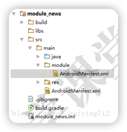

# 组件之间AndroidManifest的合并

## 问题解析
本质：组件模式向集成模式转换时，各module的AndroidManifest.xml的合并冲突问题。
1. 当项目处于组件模式时，AndroidManifest.xml应该具有一个APP所具有的的所有属性，主要是Application和启动Activity
2. 当项目处于集成模式时，AndroidManifest.xml都要合并到“app壳工程”中，各文件的Application和启动Activity在合并时会冲突。

## 解决方案
1. 为组件开发模式下的业务组件再创建一个AndroidManifest.xml
   

   > 在main文件夹下，创建一个module文件夹，用于存放组件开发模式下业务组件的AndroidManifest.xml
2. 在build.gradle中，根据isModule指定AndroidManifest.xml的文件路径
   ```groovy
   sourceSets {
      main {
         if (isModule.toBoolean()) {
            manifest.srcFile
            'src/main/module/AndroidManifest.xml'
         } else {
            manifest.srcFile
            'src/main/AndroidManifest.xml'
         }
      }
   }   
   ```

### 集成开发模式下的AndroidManifest.xml
```xml
<manifest
   xmlns:android="http://schemas.android.com/apk/res/android"
   package="com.guiying.girls">
   
   <application android:theme="@style/AppTheme">
      
      <activity
         android:name=".main.GirlsActivity"
         android:screenOrientation="portrait" />
         
      <activity
         android:name=".girl.GirlActivity"
         android:screenOrientation="portrait"
         android:theme="@style/AppTheme.NoActionBar"
         />
      
   </application>
</manifest>
```

### 组件模式下的AndroidManifest.xml
```xml
<manifest xmlns:android="http://schemas.android.com/apk/res/android"
    package="com.guiying.girls">
   
   <application
      android:name="debug.GirlsApplication"
      android:allowBackup="true"
      android:icon="@mipmap/ic_launcher"
      android:label="@string/girls_name"
      android:supportsRtl="true"
      android:theme="@style/AppTheme">
      <activity
         android:name=".main.GirlsActivity"
         android:screenOrientation="portrait">
         
      <intent-filter>
         <action
           android:name="android.intent.action.MAIN" />
         <category
           android:name="android.intent.category.LAUNCHER" />
      </intent-filter>
      </activity>
      
      <activity
         android:name=".girl.GirlActivity"
         android:screenOrientation="portrait"
         android:theme="@style/AppTheme.NoActionBar"
         />
   </application>
   
</manifest>
```