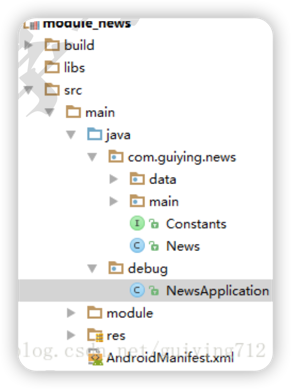

# 全局Application获取

## 关于Application
1. 系统默认会为启动的程序创建一个Application类的对象。
2. Application对象的生命周期等于程序的生命周期。
3. 可以自定义Application（在AndroidManifest.xml中声明），系统会创建自定义的Application，而不是默认的Application。

## 组件化中Application的冲突问题
1. 组件化开发时，每个组件都可能会自定义一个Application类。
2. 当所有组件要打包合并时，程序只能有一个Application，组件中自定义的Application将无法使用。
***
## 解决方案

### 关于Common组件
1. 主要封装了项目中需要的基础功能，包括BaseApplication类。
2. 每一个业务组件都要依赖Common组件。

### 关于BaseApplication类
1. 被各个业务组件和app壳工程中声明的Application类所继承。
2. 作为全局的Application使用。

### 组件模式转集成模式后，将组件的Application剔除出项目


1. 在java路径下创建debug文件夹，新建NewsApplication。
2. 在业务组件的 build.gradle 中，根据isModule是否是集成模式，将debug文件夹排除。
    ```groovy
    sourceSets {
        main {
            if (isModule.toBoolean()) {
                manifest.srcFile
                'src/main/module/AndroidManifest.xml'
            } else {
                manifest.srcFile
                'src/main/AndroidManifest.xml'
                // 集成开发模式下排除debug文件夹中的所有Java文件
                java {
                    exclude 'debug/**'
                }
            }
        }
    }
    ```


