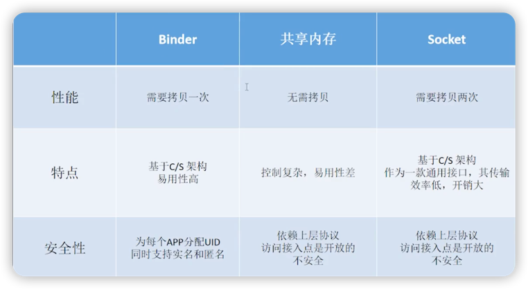

# Binder简介

## 多进程的优点
1. 突破单进程内存限制。
    > 如何查看当前机器单进程可用内存大小？
    > >ad shell + getprop dalvik.vm.heapsize
2. 功能稳定性
    > 将需要稳定运行的功能（例如通信）单独放一个进程。
3. 规避系统内存泄漏。
    > 独立的Webview进程阻隔内存泄漏导致的问题。
4. 隔离风险。
    > 对于不稳定的功能放入独立进程，避免主进程崩溃。

## Binder是什么?
1. 进程间通信**机制**。
2. 虚拟物理设备**驱动**。
3. 发起IPC的**Java类**。

## 相比于其它IPC方案的优势
1. 性能：只需要**一次数据拷贝**，性能上仅次于共享内存。
2. 稳定性：基于**C/S架构**，职责明确，架构清晰，因此稳定性好。
3. 安全性：为每个App分配**UID**（鉴别进程身份的重要标志）。

