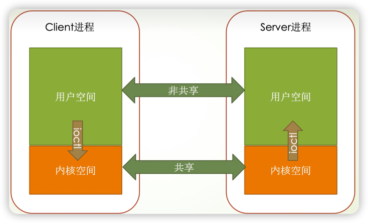

# 用户空间和内核空间

内核空间和用户空间都是虚拟内存。

### 内核空间：运行内核程序，空间共享。
> 内核空间内存共享的原理：它们的虚拟内存映射着同一块物理内存。
>
> 例如：
>
> >进程A：它的内核空间是一个地球仪，用户空间是一张🇺🇸地图，映射的是地球上的🇺🇸区域。
>
> >进程B：它的内核空间是一个地球仪，用户空间是一张🇯🇵地图，映射的是地球上的🇯🇵区域。

### 用户空间：运行用户程序，空间不共享。