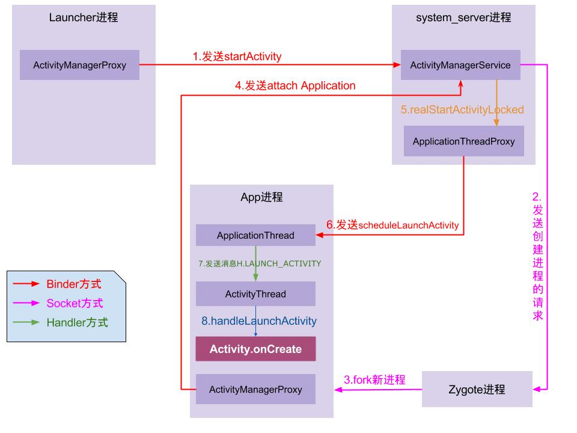

# App启动流程

<br>

## 关于Zygote(受精卵)进程

1. 在Linux中，所有进程都是由init进程（开机后由Linux内核启动）直接或间接fork（分岔）出来的。
2. Zygote进程由init进程fork出来，所有app的进程都是由zygote进程fork出来。

<br>

## 关于SystemServer进程

1. 由zygote进程fork出来的进程。
  > ZygoteInit.main()中调用startSystemServer()
2. 系统中重要的服务都在此进程中开启。
  > ActivityManagerService、PackageManagerService、WindowManagerService等。

<br>

## 关于ActivityManagerService
1. 负责系统中所有Activity的生命周期。
2. 在SystemServer进程开启时初始化。
  ```java
  private void startBootstrapServices() {
    // ...
    mActivityManagerService = mSystemServiceManager.startService(ActivityManagerService.Lifecycle.class).getService();
    // ...
  }
  ```

<br>

## Android中的C/S概念
服务端：指所有App共用的系统服务(XxxxxManagerService)。
> 例如，想打开一个App，可通过如下方法可以打开：
> > startActivity(new Intent(new ComponentName(packageName, className)));
> #### 实际操作
> 1. 告诉AMS：“我要打开这个App，我知道他的住址和名字，帮我打开吧！
> 2. AMS会通知Zygote进程fork出一个新进程，来开启目标App。

<br>

## Android的IPC
思考：App进程、AMS(SystemServer进程)、Zygote进程，它们之间如何通信的？

APP进程&SystemService进程：Binder。

App进程&Zygote进程：Socket。

<br>

## 关于Launcher(桌面启动器)
1. Launcher本质上也是一个App，也有自己的入口Activity。
  ```java
  public final class Launcher extends Activity implements View.OnClickListener,
    OnLongClickListener, LauncherModel.Callbacks, View.OnTouchListener {}
  ```
2. 桌面App图标点击事件
  ```java
  // Open shortcut
  boolean startActivitySafely(View v, Intent intent, Object tag) {
    boolean success = false;
    try {
      // 开启Activity
      // 内部会调用Activity.startActivity(intent, opts.toBundle())
      // 开启的Activity会放入到新的栈中(intent.addFlags(Intent.FLAG_ACTIVITY_NEW_TASK));
      success = startActivity(v, intent, tag);
    } catch (ActivityNotFoundException e) {
      // ...
    }
      return success;
  }
  ```
  
<br>

## 关于Instrumentation(仪器)
1. 与Application和Activity的创建和生命周期相关。
2. 一个App进程中只有一个Instrumentation，每个Activity都持有它的引用。
3. 创建：startActivity方法内，调用了Instrumentation的execStartActivity方法。
4. 生命周期：Instrumentation的callActivityOnCreate方法内，调用了Activity的onCreate方法。

> 如果把Activity比作员工，那么Instrumentation可比作是老板娘，老板就是ActivityThread。

<br>

## 关于ActivityThread
1. 就是UI线程（runOnUiThread方法）。
2. 负责与AMS通信（通过binder）。
  > #### 小剧场
  > 1. AMS对ActivityThread说：“ActivityThread，给我暂停一个Activity！”
  > 2. ActivityThread对Instrumentation说：“老婆，AMS让暂停一个Activity，快把这事办了吧。”
  > 3. Instrumentation暂停了某个Activity。
  > > AMS是董事会，负责指挥和调度Activity，但并不直接管理Activity。

<br>

1. 点击桌面App图标，Launcher进程采用Binder IPC向system_server进程发起startActivity请求；
2. system_server进程接收到请求后，向zygote进程发送创建进程的请求；
3. Zygote进程fork出新的子进程，即App进程；
4. App进程，通过Binder IPC向sytem_server进程发起attachApplication请求；
5. system_server进程在收到请求后，进行一系列准备工作后，再通过binder IPC向App进程发送scheduleLaunchActivity请求；
6. App进程的binder线程（ApplicationThread）在收到请求后，通过handler向主线程发送LAUNCH_ACTIVITY消息；
7. 主线程在收到Message后，通过发射机制创建目标Activity，并回调Activity.onCreate()等方法。




到此，App便正式启动，开始进入Activity生命周期，执行完onCreate/onStart/onResume方法
