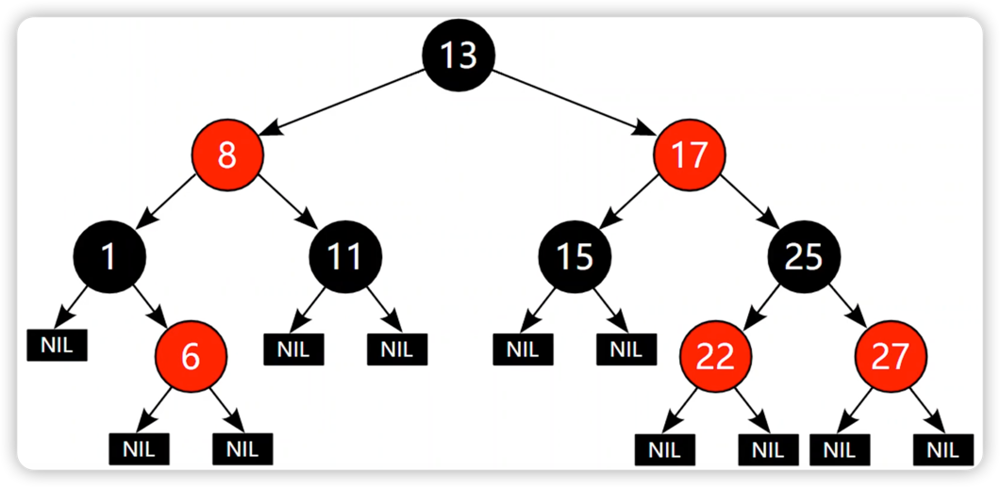
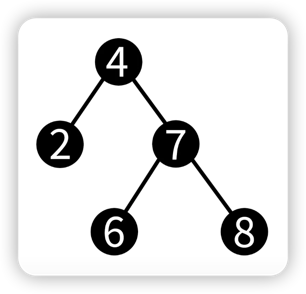
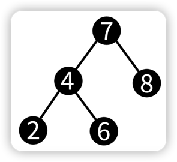
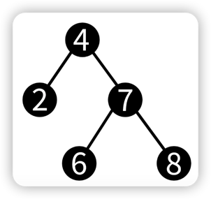
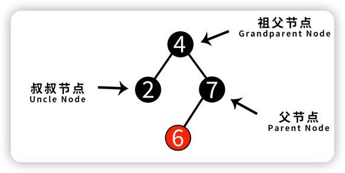

# 红黑树
自平衡二叉树，平衡二叉树在不断插入或删除的过程中要需要大量的调整，效率较低。

## 特点
1. 使用红黑来标记节点。
2. 红节点不会与黑节点相连。
3. 根节点必须要黑色的。
4. 叶子节点是NIL(外部节点)，也属于黑节点。
5. 对于任意节点，它到它下面任意叶子节点路径中的黑节点数都是相同的。
6. 红黑树的最大高度是2*log2(n+1)。
   

* 不需要每次插入或删除都做调整。
* 当插入或删除频繁，优先用红黑树；当查询频繁，优先用平衡二叉树。

***

## 红黑树的变色和旋转

🤔 为什么需要变色和旋转？
> 在插入和删除的过程中，红黑色的性质可能会发生改变。
> 
### 变色
1. 把红色变为黑色。
2. 把黑色变为红色。

### 左旋

🤔 如何对节点4进行左旋？
> 1. 让节点7成为节点4的父节点
> 2. 让节点7的左子树成为节点4的右子树
> 
> 
> 

### 右旋

> 🤔 如何对节点7进行右旋？
> 
> 1. 让节点4成为节点7的父节点
> 2. 让节点4的右子树成为节点7的左子树
> 
> 
> 
***
## 红黑树的插入

