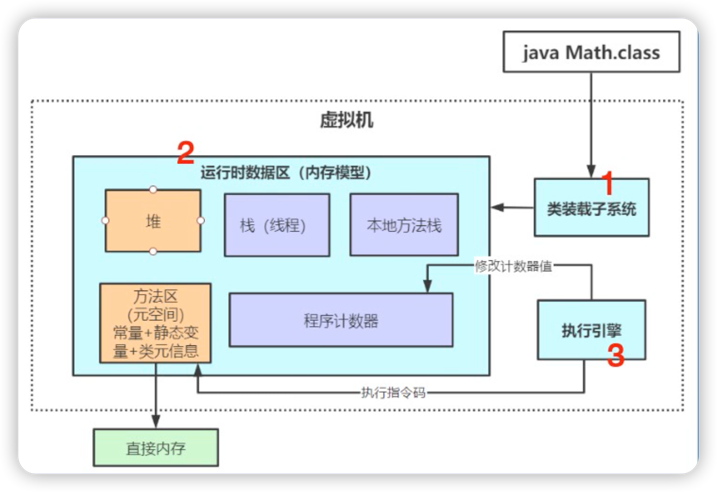
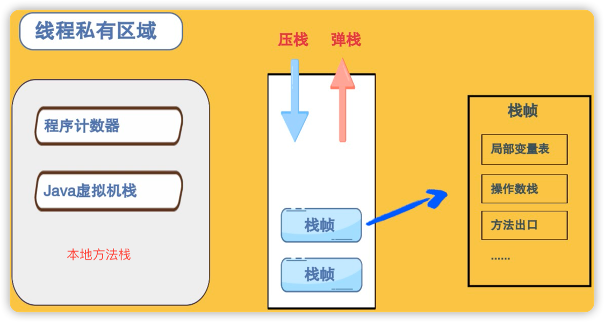
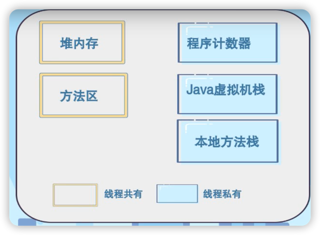
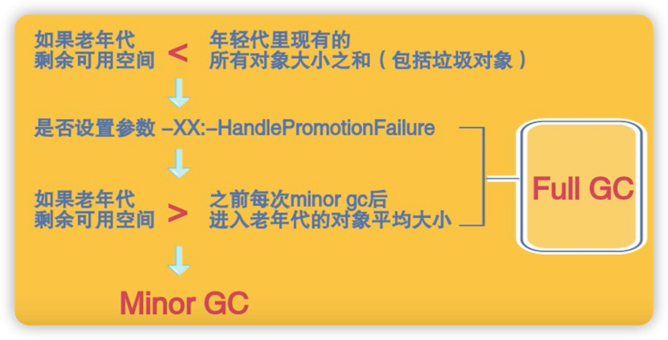
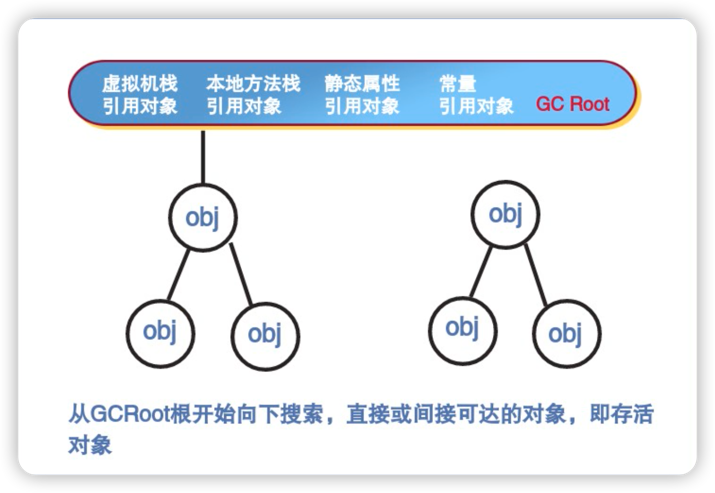
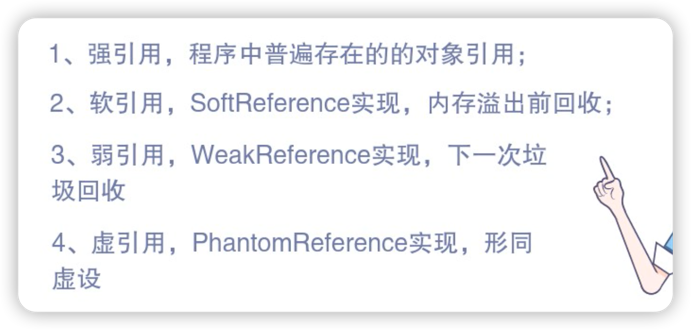
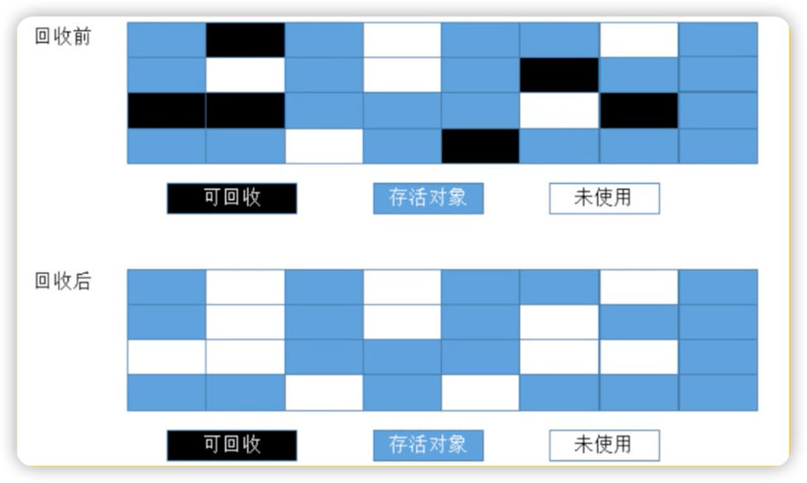
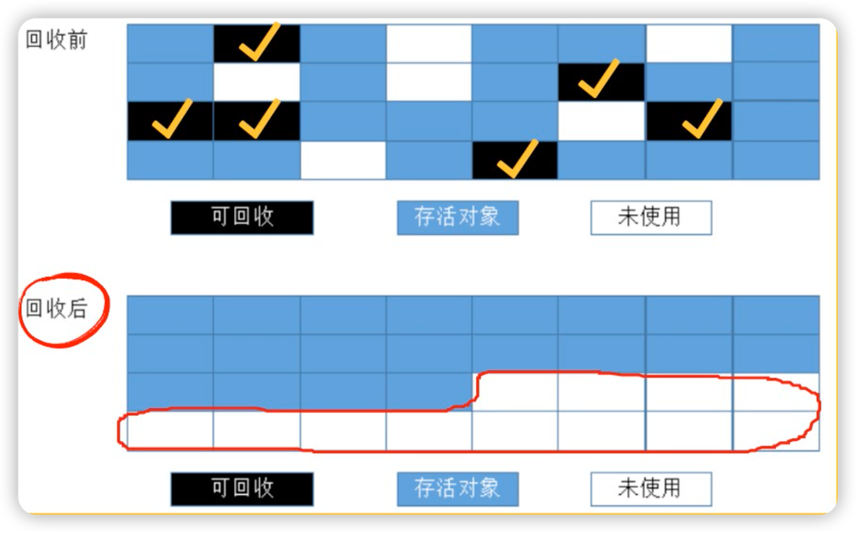
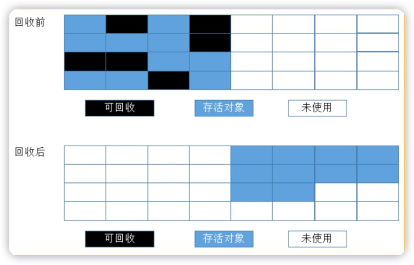

# 目录
1. [JVM内部由哪三大块组成？](#1)
   1. 类装载器子系统
    2. 运行时数据区
    3. 执行引擎
2. [什么是类的加载？](#2)
3. [运行时数据区内存划分](#3)
   1. 程序计数器
    2. Java虚拟机栈
    3. 本地方法栈
    4. 堆内存
    5. 元数据区(方法区)
4. [JVM内存分配策略一](#4)   
   对象优先在Eden区分配，当Eden区没有足够空间时，虚拟机将发起一次minorGC。
5. [JVM内存分配策略二](#5)   
   大对象直接进入老年代，长期存活的对象将进入老年代。
6. [JVM内存分配策略三](#6)   
   对象动态年龄判断。
7. [JVM内存分配策略四](#7)   
   老年代空间分配担保机制
8. [JVM如何判断对象是否存活](#8)
   1. 引用计数法
   2. 可达性分析法
9. [四种JVM垃圾回收算法](#9)
   1. 标记清除
   2. 标记整理
   3. 复制
   4. 分代回收

***

### 
****1. JVM内部由哪三大块组成？****

   
***
### 
****2. 什么是类的加载？****

定义：将类的class文件中的**二进制数据** **读** 入到内存中，并且其 **放** 入到**方法区**内，然后在**堆区**创 **建** 一个**class对象**。

#### **类加载过程**

① 加载 → ② 链接(验证→准备→解析) → ③ 初始化。

#### **类加载器类型**
|类型|加载的jar路径|
| --- | --- |
|启动类加载器|JAVA_HOME/lib/xxx.jar|
|扩展类加载器|JAVA_HOME/lib/ext/xxx.jar|
|应用程序类加载器|CLASS_PATH/xxx.jar（用户写的和导入的jar）|
|自定义加载器|用户自定义路径下的类包|
***
### 
****3. 运行时数据区内存划分****

#### 线程**私有**区域
1. **程序计数器**：📝字节码执行的行号。
2. Java**虚拟机栈**：
> 压栈：当Java方法被执行时，会形成栈帧，放入到栈内存中。
> 
> 出栈：当Java方法执行完，栈帧会弹出。
> 
> 栈帧：存储着**局部变量表，方法出口，操作数栈**等信息。
> 
3. 本地方法栈

   
#### 线程**共有**区域
1. 堆内存：分配所有对象实例的地方，GC活动的主要区域。
2. 元数据区(方法区)：加载的类信息，常量，静态变量。

***
### 
****JVM内存分配策略一****

1. 对象优先在**Eden区**分配。
> 💡 堆内存划分为老年带和年轻代，年轻代又分为Eden区和幸存者区，幸存者区又分为from和to区。
> 

> 
2. 当Eden区没有足够空间时，虚拟机将发起一次**minorGC**。
> 🤔 MinorGC和FullGC有何不同？
> 
> MinorGC：也称为YoungGC，指发生在**新生代**的垃圾回收动作，触发频繁，回收速度快。
> 
> FullGC：也称为MajorGC，一般是f会回收年轻代、老年代、方法区的垃圾，速度较慢。

***
### 
****JVM内存分配策略二****

#### 大对象直接进入老年代
> 💡 大对象：需要**大量连续内存空间**的对象，比如字符串、数组。
> > JVM可以通过参数来设置大对象的大小阈值
> >
> > -XX:PretenureSizeThreshold（对象超出阈值直接进入老年代）

#### 长期存活的对象将进入老年代
> 虚拟机给每个对象一个**年龄计数器**
> 
> 1. 如果对象在Eden区出生，并经过一次minorGC后存活，将被移至幸存者区(只要空间足够)，对象age设为1。
> > 如果幸存者区放不下，则部分移至老年代，部分移至幸存者区。
> 2. 对象在幸存者区每熬过一次minorGC，age就会+1。
> 
> 3. 当对象age增至15时，就会被移至老年代。

***
### 
****JVM内存分配策略三****

#### 对象动态年龄判断

这个规则是希望可能长期存活的对象尽早进入老年代。

一般在minorGC之后触发。

***
### 
****JVM内存分配策略四****

#### 老年代空间分配担保机制
每次minorGC之前，JVM都会计算一次老年代剩余可用空间。

***
### 
**JVM如何判断对象是否存活**

1. 引用计数法

   
2. 可达性分析法

> 💡 对象引用的分类
> 
> 

***
### 
****四种JVM垃圾回收算法****

1. **标记清除算法**

标记出所有需要♻️的对象，标记完后统一♻️。

缺陷：会产生大量不连续的内存碎片。

2. **标记整理算法**

回收后会集中整理内存区域。

缺陷：效率较低。

3. **复制算法**
   1. 将内存划分为大小相同的两块。
   2. 每次只用其中一块，当一块用完时，就把还存活的对象复制到另外一块上。
   3. 把已使用的内存块清理掉。
   

优点： 效率高，没碎片，适合短生命的内存对象。

缺点：内存利用率低，不适合老年代使用。

4. **分代回收算法（JVM采用）**

