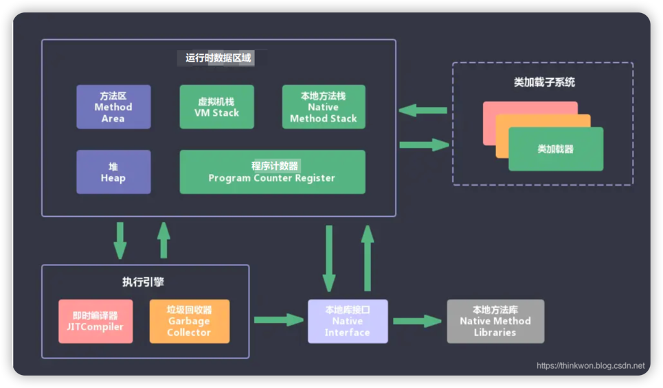
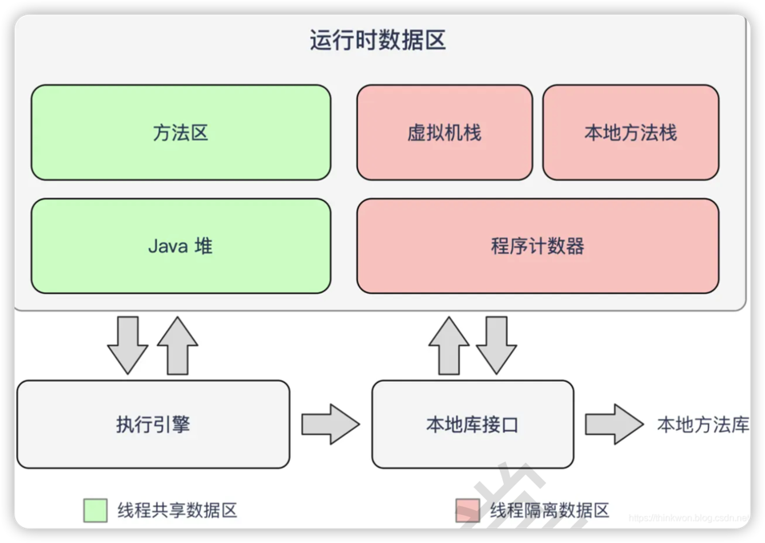

# JVM 的主要组成部分及其作用

## 组成部分

记忆
1. **CENR**（class execution/engine native runtime）
2. **装载**class到方法区。
3. **执行**class指令。
4. 与本地库**交互**。
5. **内存**区。

### Class loader(类装载)
根据给定的全限定名类名(如: java.lang.Object)来装载class文件到Runtime data area中的method area。

### Execution engine(执行引擎)
执行classes中的指令。

### Native Interface(本地接口)
与native libraries交互，是其它编程语言 交互的接口。

### Runtime data area(运行时数据区域)
这就是我们常说的JVM的内存。

记忆：两区（线程共享），两栈，一器。

程序计数器：字节码行号指示器。

Java虚拟机栈：存储局部变量、操作数栈、动态链接、方法出口等信息。

本地方法栈：同Java虚拟机栈，服务C语言。

堆区：最大、分配对象内存。

方法区：存储类信息、常量、静态变量、即时编译后代码。

***

## 作用

