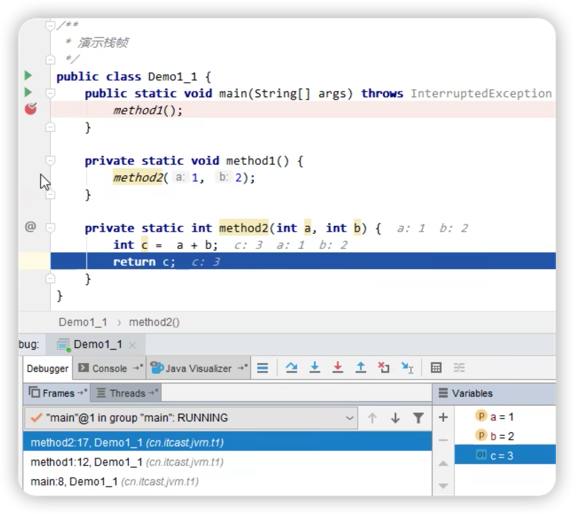

# Java虚拟机栈

## 栈
对应线程运行需要的内存空间，由多个栈帧组成。
***
## 栈帧
对应一次方法的调用所需的内存。

存放方法的：
1. 传参
2. 局部变量
3. 方法出口
***
## 演示栈与栈帧

***
## 栈内存溢出

StackOverflowError

1. 栈帧过多导致溢出（递归）。
2. 栈帧过大导致溢出（可通过设置栈内存大小复现）。
***
## 栈区的问题

### 垃圾回收是否涉及栈区？

不会。因为每次方法调用结束后，栈帧会自动弹出栈，所占内存会被释放掉。

### 栈内存分配越大越好吗？

不是。栈内存分配过大，会导致线程数减少。物理内存是固定的，栈内存变大后，可执行的线程数会减少。

### 方法内的局部变量是否是线程安全的？
如果局部变量没有作为返回值返回，或是传承传入，那么是线程安全的。
> 因为局部变量位于java虚拟机栈的栈帧中，java虚拟机栈会为每个线程创建一个单独的栈，所以栈帧中的数据是线程安全的。

如果局部变量接收了方法传参，或是作为返回值返回，有可能被其它线程访问和修改，不一定安全。