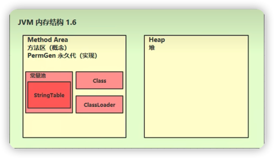
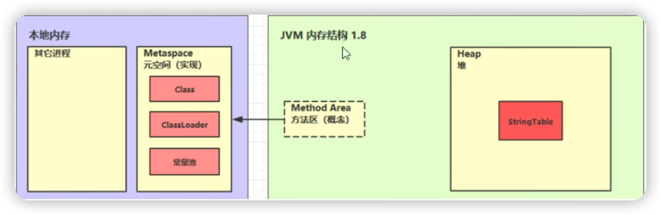
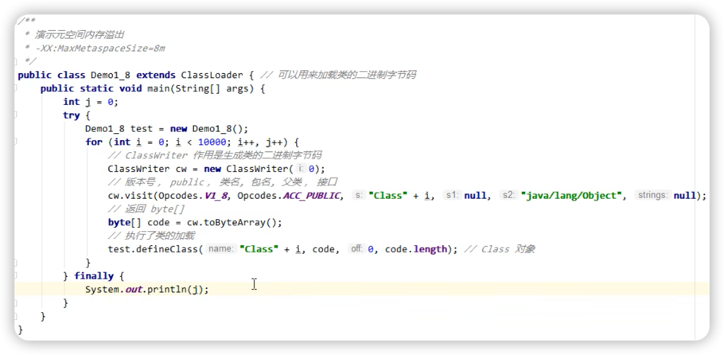
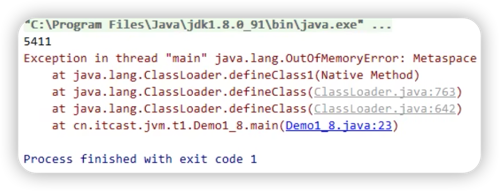
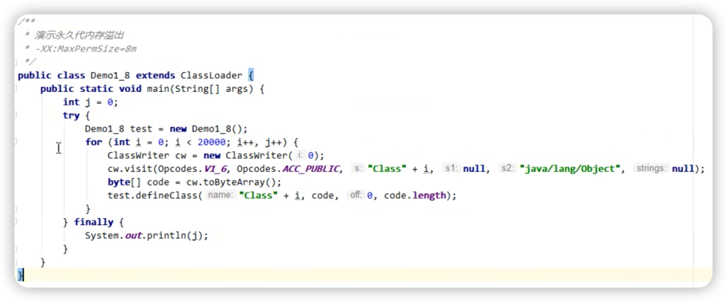
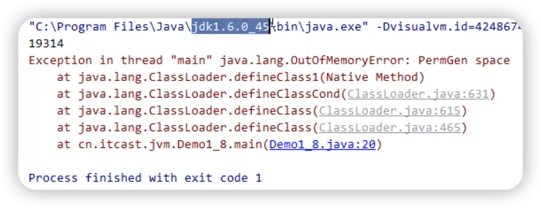

# 方法区
1. 简介
2. Java1.6的方法区
3. Java1.8的方法区
4. 方法区内存溢出
    1. 演示元空间的内存溢出
    2. 演示永久代的内存溢出
5. 运行时常量池
    
***

## 简介
1. 线程共享。
2. 存放类信息、常量、静态变量。
3. 在JVM启动时被创建，也会发生OOM。
4. 方法区只是一个概念，在Java1.8之前和之后有着不同的实现。

***

## Java1.6的方法区

1. 以**永久代**作为方法区的实现。
2. 包含类信息、类加载器、运行时常量池。
3. 占用堆内存，由JVM来管理。
***
## Java1.8的方法区

1. 以**元空间**作为方法区的实现。
2. 占用本地内存。
3. 字符串常量池被移到堆区。
***
## 方法区内存溢出

### 演示元空间的内存溢出
元空间用的是系统内存（例如16G大小），所以需要设置虚拟机参数来限制下大小。

### 演示永久代的内存溢出

***

## 运行时常量池

### 理解常量池

常量池是一张表，

[点击查看](doc/理解常量池.md)