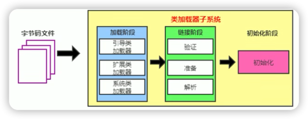
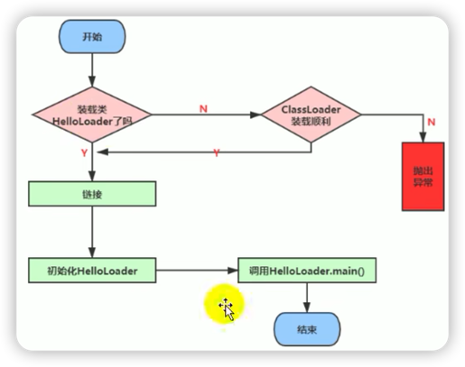

# 类的加载

## 加载

本质是将class文件转换为java.lang.Class对象的过程。

1. class文件可以是本地的，也可以是网络的。
2. 类加载器读取到的class类信息被存放到方法区。
3. java.lang.Class对象创建在堆区。

## 链接之验证

验证字节码文件，保证类的正确性。

## 链接之准备

为类变量分配内存并设置初始值。

## 链接之解析

将常量池内的符号引用转换为直接引用的过程。

## 初始化

 

***
# 参考

1. [尚硅谷宋红康JVM全套教程](https://www.bilibili.com/video/BV1PJ411n7xZ?p=29&share_source=copy_web&vd_source=9355e6cdd71213da3b305d759d88f1de)
2. [黑马程序员JVM完整教程](https://www.bilibili.com/video/BV1yE411Z7AP?p=26&share_source=copy_web&vd_source=9355e6cdd71213da3b305d759d88f1de)

