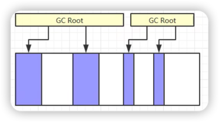

#标记清除算法

最基础的垃圾回收算法，分为两个阶段。

1. 标记阶段：标记出所有需要回收的对象
   
   记录内存起始-结束地址，放入地址列表中。
   > 
   > 
   > GCRoot不可达的对象将会被标记。
2. 清除阶段：回收被标记的对象所占用的空间。

   分配新对象时，从地址列表中去找，如果有则利用这块空间做内存分配。
   
   >思考：Windows系统的回收站清空后，内存地址也只是被标记，等下次利用时才会被覆盖掉。（陈冠希艳照门事件）
   > 
   > 
   
## 优点

效率高。

## 缺点

内存碎片化严重。
