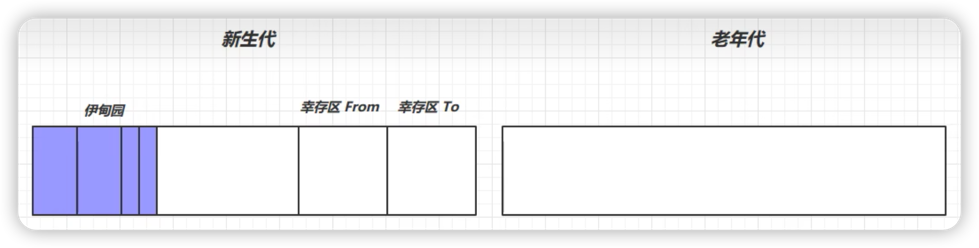

# 分代回收算法

## 内存划分

分代回收算法将堆内存区域划分为两块：
1. **新生代**：存放短生命周期对象。
    1. 伊甸园
    2. 幸存者From区
    3. 幸存者To区
2. **老年代**：存放长生命周期对象。

## 工作流程
1. 新建的对象会放入伊甸园区。
    
   
2. 当伊甸园区快满时，会触发**MinorGC**(会暂停其它用户线程)。
    
   1. 将幸存的对象复制到幸存者To区。
        
   2. 给幸存的对象生命标记为1。
        
   3. 清除伊甸园区，并交互From区和To区。
        

3. 当伊甸园区又快满时，会再次触发**MinorGC**。
    
   1. 会对幸存者From区和伊甸园区的对象都进行标记。
        
   2. 将幸存者From区垃圾对象清除掉。
   3. 将幸存者From区存活对象移到To区，生命标记为2。 
   4. 将伊甸园区存活对象移到幸存者From区，生命标记为1. 
   5. 交换幸存者From区和To区。
    
4. 如果幸存者From区的对象生命达到一定阈值（15），则将此对象移到老年区。
    
   
5. 当整体空间不足时，会触发一次**FullGC**(也会暂停其它用户线程)。
    
   
    FullGC会对整个堆内存进行垃圾回收处理(采用标记清除和标记整理算法)。
***
## 问题

### 什么是分代垃圾回收？
根据对象的 ____ 的长短，把对象分成不同的种类，年轻代、____ 和 ____ ，
并分别进行内存回收。

   

查看答案

<pre>
生命周期，老年代，永久代
</pre>

### 比较常用的运用分代回收算法的JVM是什么？

查看答案

<pre>
SUN公司的HotSpot
</pre>

### 分代回收算法的主要思路是什么？
把堆分成 ____ ，每一个 ____ 被视为一代，在运行的过程中，优先收集哪些  ____
的对象，如果一个对象经过多次收集仍然 ____ ，那么就可以把这个对象 ____
到高一级的堆里，减少对其的 ____ 次数。

查看答案

<pre>
多个子堆 子堆 年幼 存活 转移 扫描
</pre>

### 年轻代主要分为哪三个部分

查看答案

<pre>
Eden区和两个相同的Survivor区
</pre>

### 年轻代的Eden区（伊甸园区）主要用来存储什么？

查看答案

<pre>
新建的对象
</pre>

***

### 年轻代的两个Survivor区（幸存者区）也被成为什么区？
### 它们的大小是相同的吗？
### 工作机制是什么？

查看答案

<pre>
from区和to区
是的
在使用复制回收算法时，作为双缓存，起到内存整理的作用
</pre>

***

### 老年代主要用来存放哪两种对象？

查看答案

<pre>
长生命周期的对象，超大的对象
</pre>

### 永久代主要用来存放什么？

查看答案

<pre>
字符串常量池，静态变量
</pre>

