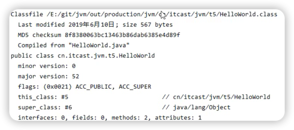
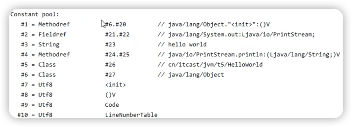
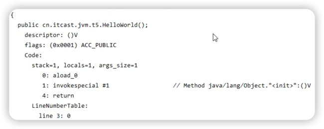

# 理解常量池

``` java
public class HelloWorld {
    public static void main(String[] args) {
        System.out.println("Hello World");
    }
}
```

要运行HelloWorld.java

1. 将HelloWorld.java编译为二进制字节码。
   > 字节码包含了
   > 1. 类的基本信息
   > 
   > 2. 常量池
   > 
   > 3. 类方法定义
   > 