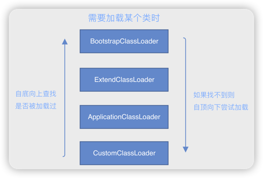

# 双亲委派

## 快速理解

记忆：BEAC

> 🤔 如果自定义了一个java.lang.String的类，是否会被加载？
> > 不会，因为系统的java.lang.String类会被BootstrapClassLoader首先加载

BootstrapClassLoader：启动类加载器，用来加载JAVA_HOME/lib/下的jar包

ExtensionClassLoader：扩展类加载器，用来加载JAVA_HOME/lib/ext/下的jar包

ApplicationClassLoader：应用类加载器，用来加载CLASSPATH下的jar包

CustomClassLoader：自定义类加载器

***

## 好处
1. 避免类被重复加载。
2. 避免恶意类的加载。
3. 类被尽量加载。