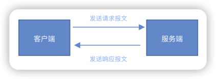
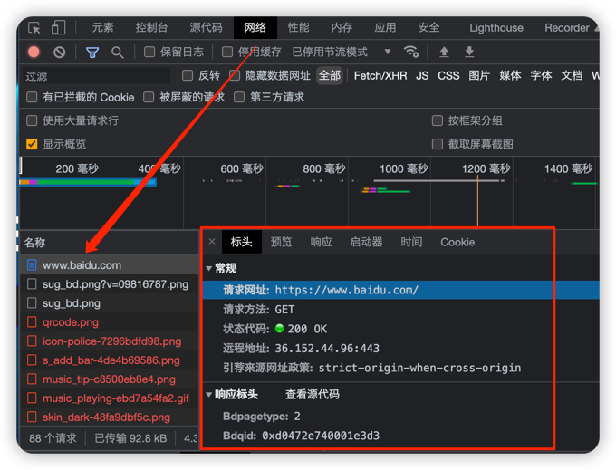

***
### 什么是请求报文？
客户端向服务端请求数据时发送的信件。
***
### 什么是响应报文？
服务端响应客户端请求时发送的信件。
***
### 如何在浏览器中观察报文？

***
### 报文格式
1. <font color=#dea32c>**起始行**</font>：start line，描述请求或响应的基本信息。
> <font color=#33a3dc>**请求行格式**</font>：<font color=#dea32c>**METHOD**</font> 空格 <font color=#dea32c>**URI**</font> 空格 <font color=#dea32c>**VERSION**</font> 换行  
>> <font color=#00a6ac>**METHOD**</font>：请求方法，如GET/HEAD/PUT/POST，表示对资源的操作  
>> <font color=#00a6ac>**URI**</font>：请求目标，通常是一个URI，标记了请求方法要操作的资源。
>> <font color=#00a6ac>**VERSION**</font>：版本号，表示报文使用的HTTP协议版本。
> 
> 请求行举例：<font color=#ad8b3d>**GET /index.html HTTP/1.1**</font>
> ***
> <font color=#33a3dc>**响应行格式**</font>：<font color=#dea32c>**VERSION**</font> 空格 <font color=#dea32c>**STATUS CODE**</font> 空格 <font color=#dea32c>**REASON**</font> 换行
>> <font color=#00a6ac>**VERSION**</font>：版本号，表示报文使用的HTTP协议版本。  
> <font color=#00a6ac>**STATUS CODE**</font>：状态码，一个三位数字，表示处理结果。例如200表示成功，500表示服务器错误。  
> <font color=#00a6ac>**REASON**</font>：原因，作为数字状态码的补充，更详细的文字描述。

<br>

2. <font color=#dea32c>**头部字段集合**</font>：header，使用键值对的形式更详细地说明报文。
> 请求头举例：HTTP/1.1 200 OK  
> 响应头举例：Connection: keep-alive
> ***
> 常用头字段：请求头字段，响应头字段，通用字段（在请求头和响应头中均可出现，例如Content-type，Connection等）

<br>

3. <font color=#dea32c>**空行**</font>。

<br>

4. <font color=#dea32c>**消息正文**</font>。
```html
<html>
    <head>
        <title>hello world</title>
    </head>
    <body>
        well done!
    </body>
</html>
```