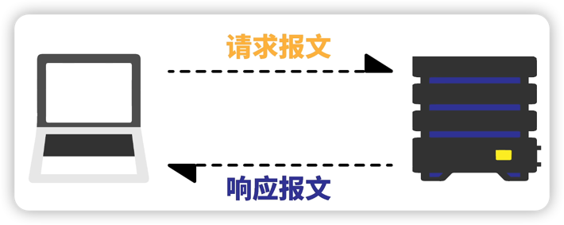
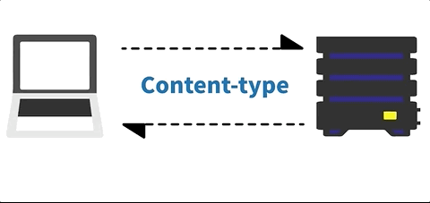
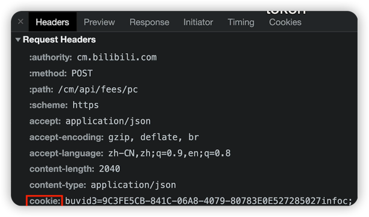

HTTP协议，超文本传输协议，位于应用层，基于传输层的TCP协议。

HTTP协议规定了客户端与服务端通信的方式。

通信的过程就是客户端发送请求报文，服务端返回响应报文。

报文必须按照规定的格式来写。

|客户端请求报文格式|服务端响应报文格式|
| :---: | :---: |
|||

> 请求报文中的**方法**最常见的是**GET**和**POST**。
> ***
> 响应报文中的**状态码**有很多种，且服务端可以自行定义：
> 1. 2xx 表示请求成功，最常见的是200
> 2. 3xx 表示重定向，让浏览器执行某些特别的处理，例如304(可以使用缓存的内容)
> 4. 4xx 表示客户端错误，最常见的是404(找不到资源)
> 5. 5xx 表示服务器错误，最常见的是500(服务器发生错误)
> ***
> 首部字段 content-type： 让浏览器更清楚地处理不同类型的数据。
>
> 

***

### HTTP/1.1开始支持的长连接
1. 服务端返回消息后，客户端可以发起下一个请求。
2. 如果没有要发送的了，客户端可以发送Connection:close首部给服务端。

***

### HTTP的无状态
服务端不会记录每个客户端的状态。

登录解决方案：在首部字段加上Cookie信息

***

### 

