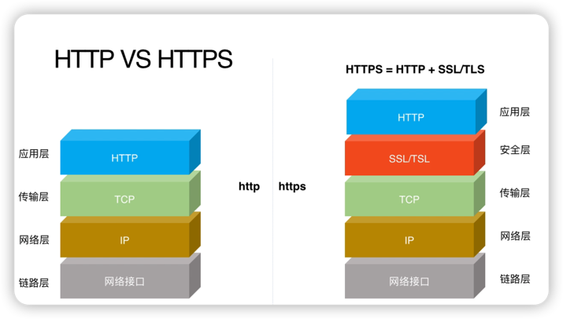
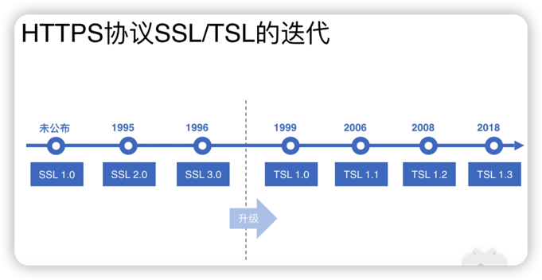
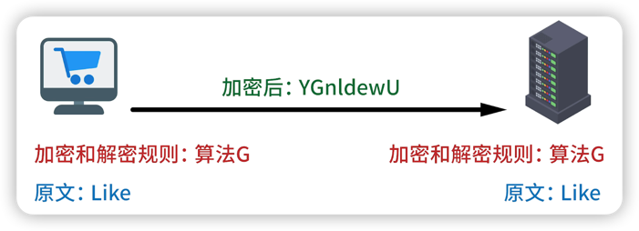
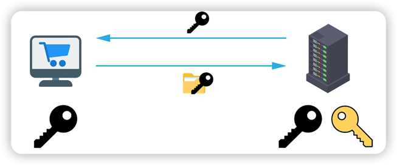
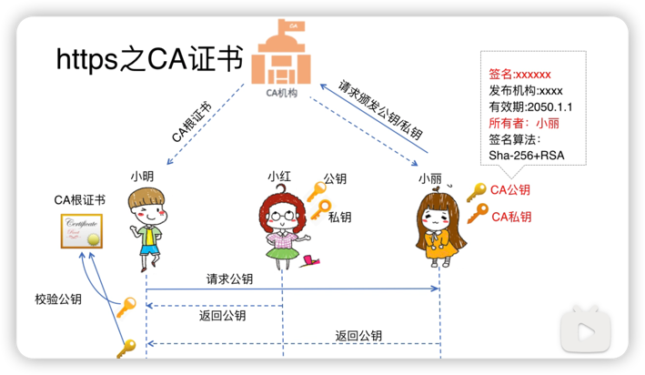

# 快速学习HTTPS
***

https在http的基础上使用 **TLS/SSL** 进行加密，使得网络协议不容易受到拦截和攻击。

SSL是TLS的前身，都属于加密安全协议。

目前绝大部分浏览器都不支持SSL，而是支持TLS。

***
## 安全措施1：混用对称加密和非对称加密
### 什么是**对称加密**？
加密和解密用的是**同一把秘钥**。

### 什么是**非对称加密**？
使用**公钥**进行**加密**，使用**私钥**进行**解密**。

优点是安全性高，缺点是加解密效率低。

> 公钥 🔑：多方都持有的钥匙。  
> 私钥 🔑：只被一方持有的钥匙，一般由服务端持有。
> 
> 数据经过公钥加密那么只能通过私钥解密。
> 
> 数据经过私钥加密那么只能通过公钥解密。
> 
> 总之**加解密不能是同一把**🔑。

> ### 场景
> > 1. 服务端持有公钥和私钥，并向客户端公布公钥。  
> > 2. 客户端使用公钥对数据进行加密，然后发送给服务端。
> > 3. 服务端收到加密的数据后使用私钥进行解密。
> 

### HTTPS的加密策略
1. 客户端从服务端处请求到公钥。
2. 客户端生成一个RandKey，并使用公钥加密，然后发送给服务端。
3. 服务端使用私钥解密拿到RandKey的明文。
4. 客户端将**数据明文+RandKey**进行**对称加密**，然后发送给服务端。
5. 服务端使用对称加密的的方式来解密数据。

***
## 安全措施2：SSL证书
用于验证服务端的身份，防止中间人冒充服务端或私发公钥给客户端。

保存在源服务器的数据文件，需要向CA(证书授权中心)申请。

只有服务端安装了SSL证书，用户才能通过HTTPS来访问域名，同时端口也会由80改为443。

