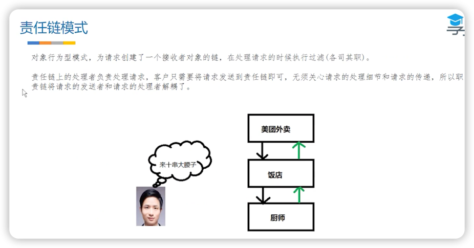
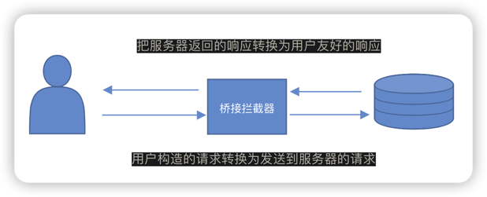

## 拦截器核心代码

1. 创建一个拦截器的列表interceptors。
2. 相继添加自定义的拦截器、重试和重定向拦截器，桥接拦截器，缓存拦截器，连接拦截器，请求服务器拦截器。
> 💡 自RBCCC
3. 将拦截器列表给Interceptor.Chain(拦截器链条)。
4. 由拦截器链条来执行请求。

***

## 责任链模式

核心：请求的发送者无需关心处理细节和请求传递，只需：将请求传递给责任链即可。实现请求的发送者和处理者完全解耦。

***
## 重试和重定向拦截器 RetryAndFollowUpInterceptor
1. 判断用户是否取消了请求。
2. 根据响应码(例如302)来判断是否需要重定向。
3. 如果需要重定向，那么服务端会将**正确的url**放入**响应头的Location字段**中，并返回响应码为**30x（301永久移动，302临时移动）**

## 桥接拦截器 BridgeInterceptor
负责将HTTP协议必备的请求头加入其中，例如HOST，并添加一些默认的行为，例如GZIP压缩，
在获得结果后，调用保存cookie接口并解析GZIP数据。

## 缓存拦截器 CacheInterceptor
使用缓存来提升请求效率。

必须创建缓存文件夹，否则该拦截器将不起作用。

在构建OKHttpClient时创建缓存，并指定缓存路径和容量。

## 连接拦截器 ConnectInterceptor
负责找到或新建一个连接，并获得对应的Socket流。

## 请求服务器拦截器 CallServerInterceptor
与服务器进行通信，发送数据、解析读取的响应数据。