## TCP / UDP

本质是在不同的程序间**通过网络传输数据**的协议。

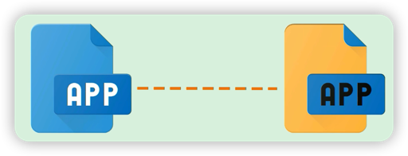

### 使用场景举例
|||
| :---: | :---: |
|浏览网页|网络聊天|

***

TCP/UDP位于网络分层中的**传输层**。

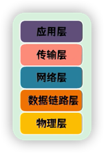

传输的数据类型可以是**文本、视频、图片**等**二进制**文件。

***

## TCP vs UDP
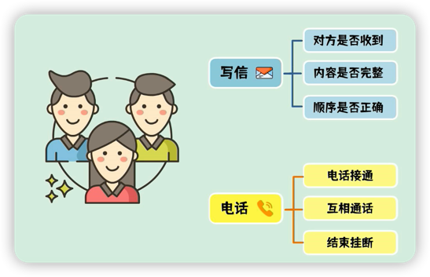

***

## TCP的三次握手
建立连接的过程。

1. **第一次**🤝：客户端发送**SYN**包给服务端询问能否建立连接。

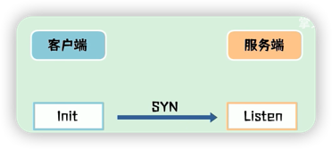

2. **第二次**🤝：服务端同意连接，回复**SYN+ACK**包。

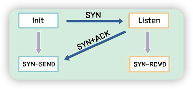

3.**第三次**🤝：客户端收到后，再回复一个**ACK**包，连接建立。

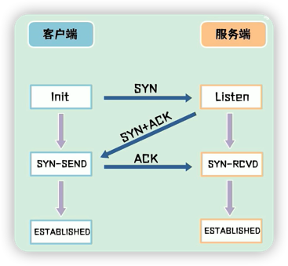

> 🤔 为什么要进行第三次握手？
> > 📒 为了防止已失效的请求报文，突然又传到服务端，引发错误。  
> 本质是为了解决网络信道不可靠的问题。
***
## TCP发送缓冲区
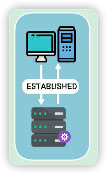

🤔 如何解决建立连接后发送数据产生的丢包问题和乱序问题？

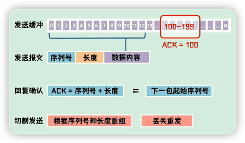
***
## TCP四次👋🏻
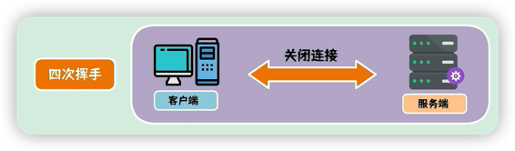

客户端和服务端均可通过四次👋🏻来关闭连接。

以客户端发起请求为例：

1. 向服务端发起FIN包，表示要关闭连接，然后进入FIN-WAIT-1(终止)状态。

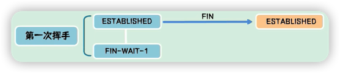

2. 服务端收到FIN包后，发送ACK包，表示进入CLOSE-WAIT状态，客户端进入FIN-WAIT-2状态，

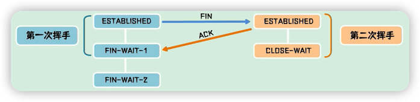

3. 服务端此时还可以发送数据，客户端也可以接受数据，待数据发送完后，发送FIN包给客户端，进入LAST-ACK(最后确认)状态。

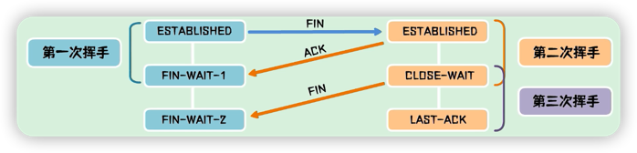

4. 客户端向服务端回复ACK包，服务端收到后立即关闭连接，客户端在超时等待后再关闭连接。

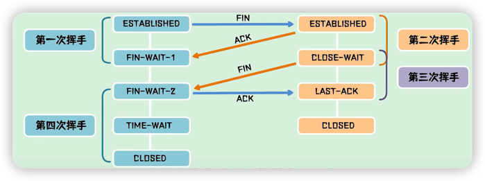

> 🤔 为什么客户端需要超时等待时间？
> > 📒 为了保证服务端已收到ACK包，防止服务端未能收到ACK包而一直处于最后确认状态。
> 
> 客户端在发送ACK后等待时，服务端会因为没有收到ACK包而重发FIN包，客户端也会重发ACK包，并刷新超时时间。
> 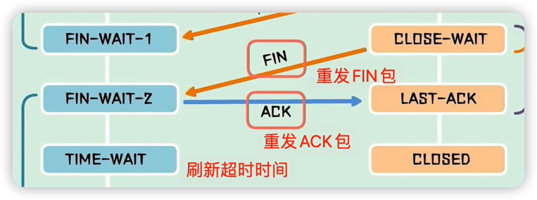

***
## UDP
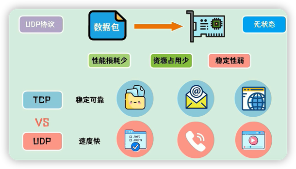

TCP：适用于对网络通信质量要求较高的场景，需要准确无误地传输给对方。

UDP：适用于对实时性要求较高，但对少量丢包没有太高要求的场景。

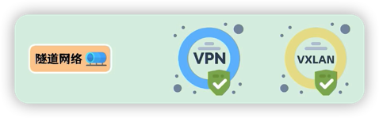

