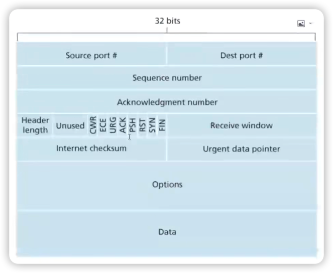

1. Source port：源端口，一般随机生成。
   

2. Dest port：物理端口，在TCP🤝🤝🤝之前一定要对方的端口号。
   

3. Sequence Number：序列数字，保证可靠性传输。
   

4. Acknowledgement Number：回执数字，保证可靠性传输。
   

5. Header length：首部长度。
   

6. Unused：保留字段。
   

7. CWR/ECE/URG/ACK/PSH/RST/SYN/FIN：报文标志。
> SYN：同步序列号报文，用于建立连接。  
> ACK：响应报文。  
> FIN：用于关闭连接。

8. Receive Window：代表当前服务器可以接收数据大小的一个窗口。

9. Urgent data pointer：紧急数据指针。

10. Options：可选参数。

11. Data：真实的业务数据。
