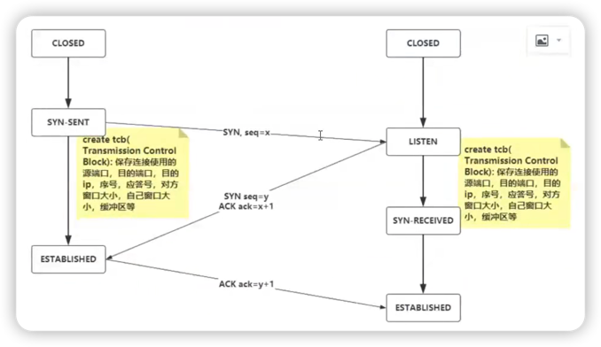

# TCP三次🤝
确立连接。

***
### 握手过程

1. 服务端首先进入LISTEN状态，监听某一个端口（80）。
2. 客户端发送给服务端一个SYN包（我可以和你连接吗？）
3. 服务端向客户端回复一个SYN包和ACK包（可以的）
4. 客户端再次向服务端发送一个ACK包（那就连接吧）
5. 连接成功。

### 🤔 第三次握手能不能省略？
不能。

因为第一次发送的SYN包可能会发生网络滞留问题。

这时客户端会再次向服务端发送SYN包。

然而之前的SYN包并没有作废，等网络恢复后会继续发送到服务端那里。

这样就产生了错误的连接。

> 第一个SYN包就像是定金，第二个ACK包就像是尾款，两笔款项都到服务端那里才能建立连接。 