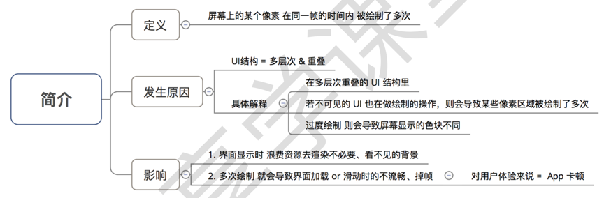
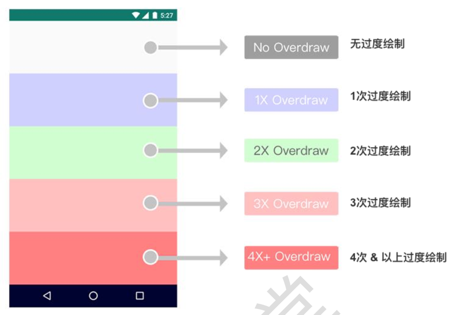
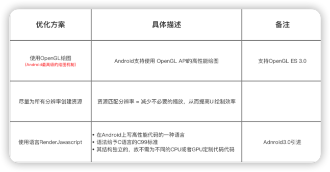

# 避免过度绘制



### 1. 过度绘制的表现形式

开发者选项 -> 调试GPU过度绘制



### 2. 过度绘制的优化原则

基本原则：无法避免，尽量控制次数<=2。

> 1. 尽可能地控制 过度绘制的次数 = 2 次(绿色)以下，蓝色最理想 
> 2. 尽可能避免 过度绘制的粉色 & 红色情况
> 3. 不允许 3 次以上的过度绘制(淡红色)面积 超过 屏幕大小的 1/4


### 3. 优化方案

#### 1️⃣ 移除默认的Window背景

方式1：themes.xml
```xml
<resources xmlns:tools="http://schemas.android.com/tools">
    <!-- Base application theme. -->
    <style name="Theme.DevLib" parent="Theme.MaterialComponents.DayNight.DarkActionBar">
        
        <!--  移除默认的背景  -->
        <item name="android:windowBackground">@android:color/transparent</item>
        <!-- 或者 -->
<!--        <item name="android:windowBackground">@null</item>-->

    </style>
</resources>
```

方式2：在 BaseActivity 的 onCreate() 方法中
``` java
getWindow().setBackgroundDrawable(null);
// 或者
getWindow().setBackgroundDrawableResource(android.R.color
.transparent);
```

#### 2️⃣ 移除控件中不必要的背景

场景1：ListView 与 Item
列表页 (ListView) 与 其内子控件 (Item) 的背景相同 = 白色，故 可移除子控件 (Item) 布局中的背景

场景2：ViewPager 与 Fragment
对于1个ViewPager + 多个 Fragment 组成的首页界面，若每个
Fragment 都设有背景色，即 ViewPager 则无必要设置，可移除

#### 3️⃣ 减少布局文件的层级

原理:减少不必要的嵌套 ->> UI层级少 ->> 过度绘制的可能性低

优化方式:使用布局标签<merge> & 合适选择布局类型

#### 4️⃣ 自定义view优化（clipRect() 、 quickReject()）

clipRect()：给 Canvas 设置一个裁剪区域，只有在该区域内才会被绘 制，区域之外的都不绘制。

quickreject()
1. 作用:判断和某个矩形相交
2. 具体措施:若判断与矩形相交，则可跳过相交的区域，从而减少过
   度绘制
   
#### 其它




