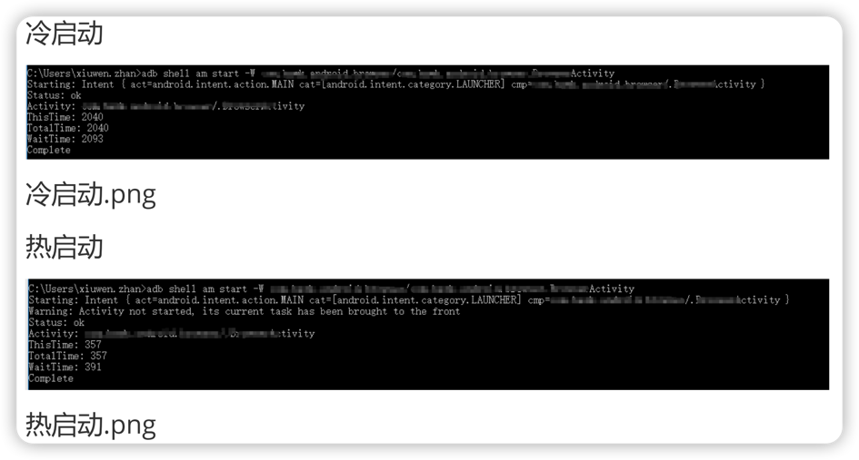

# 冷启动&热启动

## 概念
冷启动：启动一个不存在后台的应用，系统会创建一个新进程分配给该应用。

热启动：启动一个存在于后台的应用。
***
## 区别
Application重建与否。
***
## 计算启动时间
> adb shell am start -W  
> [packageName]/[packageName.XxxActivity]

#### 参数说明
1. ThisTime：一般和TotalTime时间一样。除非在应用启动时开了一个透明的Activity预先处理一些事再显示出主Activity，这样将比TotalTime小。
2. TotalTime：应用的启动时间。包含创建进程+Application初始化+Activity初始化到界面显示。
3. WaitTime：一般比TotalTime大点，包含系统影响的耗时。

