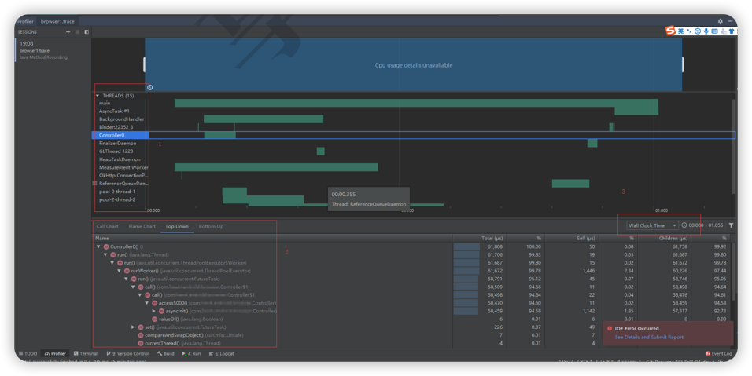
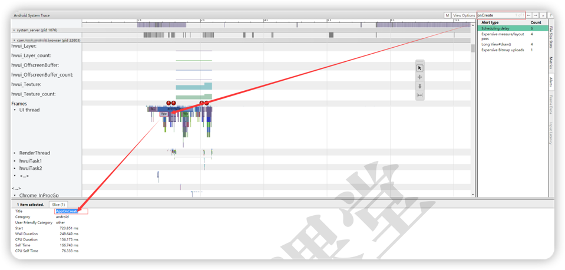

# TraceView和SysTrace工具使用

## TraceView（跟踪视图）

### 定义

1. Android平台的性能分析工具。
2. 图形化，便于分析。

### 使用方式
1. 通过Android studio自带的traceview查看（Android profiler）。
2. 通过Android SDK自带的Debug。
3. 通过DDMS中的traceview查看。

``` java
@Override
public void onCreate(final Bundle icicle) {
    setTheme(R.style.BrowserTheme);
    Intent intent = getIntent();
    NLog.i(LOGTAG,"onCreate");
    super.onCreate(icicle);
    
    // 开始记录，且该方法可以设置文件大小和路径
    Debug.startMethodTracing("browser.trace");
    
    Controller controller = createController();
    mController = controller;
    getWindow().getDecorView().setSystemUiVisibility(
        View.SYSTEM_UI_FLAG_LAYOUT_FULLSCREEN
        |View.SYSTEM_UI_FLAG_LIGHT_STATUS_BAR);
    controller.handleThirdPartyIntent(intent);
    
    // 结束记录
    // 结束后在此目录下生成如下文件
    // /sdcard/Android/data/com.xxx.xx.browser/files/browser.trace
    Debug.stopMethodTracing();
    
}
```

导出并通过AS的Profile打开此文件。



1. 左上红框可以看到有多少线程。
2. 左下红框可以看到具体方法的耗时。
3. 右侧红框有两个选项。
    1. wall clock time：代码在线程上执行的真正时间[有一部分是等待cpu轮询时间]。
    2. thread time：cpu执行的时间一般是优化的是cpu执行时间
    
***

## SysTrace

### 定义
用于收集可帮助检查原生系统进程的详细<font color=#dea32c>**系统级数据**</font>。例如：
1. CPU调度。
2. 磁盘活动。
3. 应用线程。
4. ...

### 使用方式
1. 在代码开始位置加上tag：TraceCompat.beginSection("AppOnCreate");
2. 指定位置结束：TraceCompat.endSection();
   
即可以抓取到整个应用在此过程的相关信息。

例如，在onCreate方法中添加上述两行代码，执行相关python命令：
> python systrace.py -b 32768 -t 10 -a com.xxx.xxx.browser  
> -o browser.html sched gfx view wm am app

操作相关应用，即可以抓取整个过程的相关信息：



可以看到添加的tag“AppOnCreate”，对应的时间信息

1. Wall Duration 代表的方法从开始到结束的耗时
2. CPU Duration 代表CPU的执行时间

> CPU是轮询模式，因此优化的方向可以说是两个方向:
> 1. 提高CPU的核数
> 2. 优化CPU执行的时间


