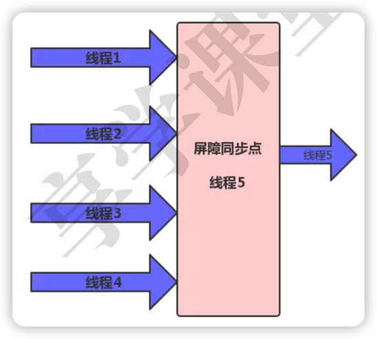

# 异步加载

## 使用子线程加载资源
1. sdk初始化。
2. 配置信息拉取。

## CountDownLatch解决多线程相互依赖

例如：资源A线程必须在资源B加载完成，才能加载，但两者又会在不同的线程之间。

> 可多了解CountDownLatch（倒计时闩，读拉趣）和CyclicBarrier（循环屏障，读赛课立刻）

## 使用 Pipeline（管道） 机制

1. 根据业务优先级规定业务初始化时机，制定启动框架，它们为各个任务建立依赖关系，最终构成一个有向无环图。
2. 对于可以并发的任务，会通过线程池最大程度提升启动速度。
3. 无论是微信的mmkernel 还是阿里的Alpha 都具备这种能力。

## 其他方案
也可以利用IdealHandler，dex分包等相关方式做到启动优化。