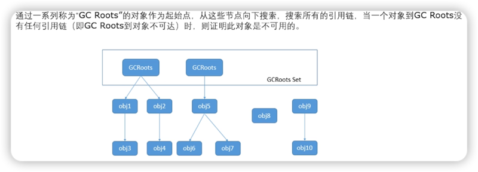

# 内存泄漏

1. 简介
2. 对程序的影响
3. 本质原因
4. 常见的内存泄漏&解决方案

## 1. 简介

英文全称：Memory Leak

在申请内存后，当该内存不需再使用时，无法被释放&归还的现象。
***
## 2. 对程序的影响

容易造成内存溢出，即**OOM**。

***
## 3. 本质原因

核心：短生命周期对象的**强引用**被长生命周期对象持有，导致无法被GC。

### 补充知识点：可达性分析法

***
## 4. 常见的内存泄漏&解决方案

1. [对象集合类](doc/对象集合类.md)
2. [静态成员变量（单例）](doc/静态成员变量.md)
3. [非静态内部类/匿名类](doc/非静态内部类.md)
4. [资源使用后未关闭](doc/资源使用后未关闭.md)
5. [其它(Context,WebView,Adapter)](doc/其它(Context,WebView,Adapter).md)

