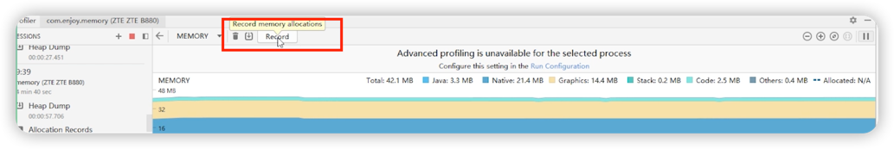

# 内存抖动

## 定义

短期内有大量对象创建和销毁，伴随着频繁的GC。

## 负面影响

### 1. 卡顿

频繁的GC会阻塞主线程。

### 2. OOM

1. GC会对老年代采用**标记清除**算法，造成大量的**内存碎片**。

   

## 典型案例
1. 使用加号拼接字符串。  

2. 在某些UpdateListener回调中创建局部对象（例如动画）。
3. 在onDraw方法中创建局部对象。

## 使用Profiler来检查内存抖动问题

### 1. 点击record按钮

### 2. 点击stop按钮后结束录制

1. 第一个FinalizerReference是由于后面对象回收时产生的，不用去管。
2. 点击下方的Path弹出右侧面板，点击某个Path查看调用栈（在哪里创建）。

   

***

https://www.bilibili.com/video/BV1Vf4y1D7qY?spm_id_from=333.337.search-card.all.click&vd_source=bcad053415c86e8df523e0a0351e604a