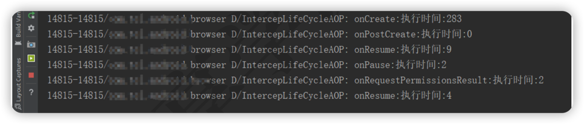

# 通过AOP获取时间

## AOP

面向切面编程(Aspect-Oriented Programming)。

### OOP vs AOP
1. OOP：把问题划分到单个模块。
2. AOP：把涉及到众多模块的某一类问题进行统一管理。
> Android 里面PMS，AMS都拥有各自的职责，
> 但是它们都需要通过log系统管理log。

### AspectJ
对AOP编程思想的一个实践。

#### 使用
``` groovy
// 根目录gradle下引用
classpath 'com.hujiang.aspectjx:gradle-android-pluginaspectjx:2.0.0'

// app目录gradle文件下引用
implementation 'org.aspectj:aspectjrt:1.8.+'
```

``` java
@Aspect
public class IntercepLifeCycleAOP {
    // 获取该Activity下的所有on开头的方法耗时
    // 使用Around注解，需要掌握一定的AspectJ相关的语法
    @Around("execution(* com.xxx.xxx.BrowserActivity.on**(..))")
    public Object getTime(ProceedingJoinPoint joinPoint)
    {
        Object proceed = null;
        
        long start = System.currentTimeMillis();
        try {
            proceed = joinPoint.proceed();
        } catch (Throwable throwable) {
            throwable.printStackTrace();
        }
        long end = System.currentTimeMillis();
        Log.d("IntercepLifeCycleAOP", joinPoint.getSignature().getName() + ":执行时间:" + (end - start));
        return proceed;
    }
}
```


