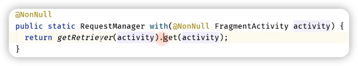
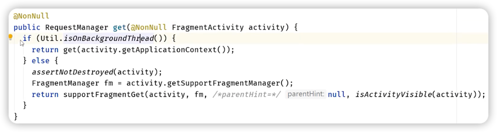

# with
获取RequestManager(请求管理器)对象。
***
## 第一层 Glide.with

调用的是 getRetriever() 的 <font color=#dea32c>**get()**</font> 方法。
***
## 第二层 getRetriever.get

1. 判断是否位于子线程。
2. 如果是则调用get(Context)方法。
3. 如果否则创建一个<font color=#dea32c>**空白的Fragment**</font>，通着这个Fragment来监听Activity的生命周期。

> 🤔 为什么Glide不能在子线程中调用with？
> 
> >答：如果在子线程中调用with，那么Glide就会获取ApplicationContext作为自己的上下文，不会添加一个空白的Fragment，从而无法感知Activity和Fragment的生命周期变化。
> 
***

当with的Fragment或Activity不可见的时候暂停请求，当with的Fragment或Activity可见的时候恢复请求。
``` java
public RequestManager get(@NonNull Context context)

public RequestManager get(@NonNull FragmentActivity activity)

public RequestManager get(@NonNull Fragment fragment)

public RequestManager get(@NonNull Activity activity)

public RequestManager get(@NonNull View view)
```

|with 参数	|作用域	|代码中线程|
|----|----|----|
|-|Application|	子线程使用with|
|View|	Fragment/Activity|	主线程|
Fragment|	Fragment|	主线程
Activity|	Activity|	主线程
FragmentActivity|	Activity|	主线程
ServiceContext/ApplicationContext|	Application|	主线程
