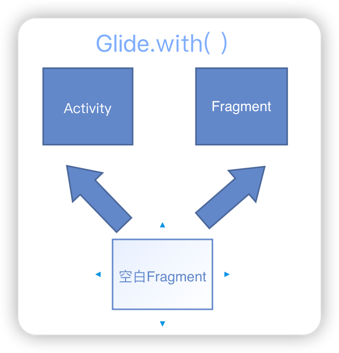

# 关键词
### RequestManagerFragment
空白Fragment，包含了LifeCycle和RequestManager
### LifeCycle
用处监听A/F的onStart、onStop、onDestroy方法并触发回调
### RequestManager
具体执行onStart、onStop、onDestroy的类，实现了根据A/F生命周期来管理Glide请求

# 实现原理

> 在Glide.with的Activity或Fragment中添加空白的Fragment，通过空白Fragment感知Activity或父Fragment的生命周期。
> 
> 
> 
> 在Fragment的onStart、onStop、onDestroy中，会调用lifeCycle的onStart、onStop和onDestroy，
> 最终会调用到FragmentManager的onStart、onStop、onDestroy，而RequestManager才是通过感知Activity和Fragment生命周期来管理Glide请求的类。

***

### Fragment与其托管Activity和父Fragment的生命周期关系
1. 添加到 Activity的 Fragment 会跟随Activity的生命周期
2. Fragment的 childFragment 则会通过 ChildFragmentManager 和 Fragment 保持生命周期一致。
***
### SupportRequestManagerFragment
> <font color=#33a3dc>**包名**</font>：com.bumptech.glide.manager
> 
> <font color=#33a3dc>**父类**</font>：androidx.fragment.app.Fragment
> 
> <font color=#33a3dc>**定义**</font>：一个<font color=#dea32c>**无视图**</font>的Fragment，用来<font color=#dea32c>**安全存储RequestManager**</font>，可以用来<font color=#dea32c>**启动、停止和管理**</font>针对Fragment或activity的目标发起的<font color=#dea32c>**Glide请求**</font>。

SupportRequestManagerFragment有个很重要的成员
``` java
private final ActivityFragmentLifecycle lifecycle;
```

> <font color=#33a3dc>**ActivityFragmentLifecycle**</font>
> 
> 实现了<font color=#dea32c>**Lifecycle**</font>接口，用来监听Activity/Fragment生命周期并触发回调。
> > Lifecycle：一个<font color=#dea32c>**监听Activity/Fragment生命周期**</font>事件的接口。
> > 
> > <font color=#ad8b3d>**addListener**</font>：添加LifecycleListener监听器。
> >
> > <font color=#ad8b3d>**removeListener**</font>：移除LifecycleListener监听器。

``` java
@Override
public void onStart() {
  super.onStart();
  lifecycle.onStart();
}

@Override
public void onStop() {
  super.onStop();
  lifecycle.onStop();
}

@Override
public void onDestroy() {
  super.onDestroy();
  lifecycle.onDestroy();
  // 接触绑定和
  unregisterFragmentWithRoot();
}
```

***
## RequestManager
用于管理和启动Glide请求的类。可以使用活动、片段和连接生命周期事件来智能地停止、启动和重新启动请求。通过实例化一个新对象来检索，或者利用内置的Activity和Fragment生命周期处理，使用静态Glide。用Fragment或Activity加载方法。