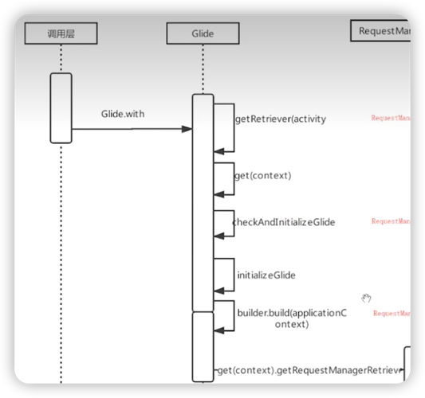

# with

## with流程时序图

***
## 流程分析
#### Glide.java
``` java
@NonNull
public static RequestManager with(@NonNull FragmentActivity activity) {
    return getRetriever(activity).get(activity);
}
```
#### RequestManagerRetriever.java
``` java
@NonNull
public RequestManager get(@NonNull FragmentActivity activity) {
    if (Util.isOnBackgroundThread()) {
      // 如果在子线程，则使用全局context，同时会将失去生命周期管理
      return get(activity.getApplicationContext());
    } else {
      // ...
      FragmentManager fm = activity.getSupportFragmentManager();
      // 该方法会创建一个空白的fragment 与activity绑定，来观察其生命周期
      // 同时返回RequestManager对象
      return supportFragmentGet(activity, fm, /*parentHint=*/ null, isActivityVisible(activity));
    }
}
```

支线流程：[生命周期绑定](支线_生命周期绑定.md)