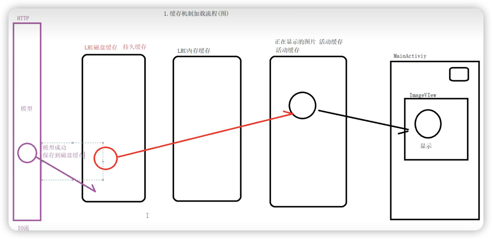

# Glide的缓存机制

## 大致流程图



### LRU回顾

当缓存满的时候，会优先淘汰最近最少使用的缓存对象。

Android的LruCache类内部维护了一个LinkedHashMap（双链表）。
> 同HashMap不同的是，LinkedHashMap维护了一个Entry的双向链表，保证了插入的Entry中的顺序
> > 如果是单链表的话，没有办法把中间的节点放到头节点上，因为不知道前面的节点是什么。

它会将最近访问到的元素移到到链表的头节点，当缓存慢时，会将尾节点移除掉。

> 有点类似于末尾淘汰制。

## 活动缓存ActivityResource

🤔 为什么Glide要搞个活动缓存？

正在使用的ImageView的缓存有可能在LruCache中被移除掉。
> 例如RV的快速滑动。


### 源码分析
#### ActiveResource.java
``` java
// 内部一个HashMap，value是缓存的弱引用
final Map<Key, ResourceWeakReference> activeEngineResources = new HashMap<>();
```


## 运行时缓存加载流程
核心方法：Engine.loadFromMemory
``` java
@Nullable
private EngineResource<?> loadFromMemory(
  EngineKey key, boolean isMemoryCacheable, long startTime) {
    // 如果内存缓存不可用，返回null
    if (!isMemoryCacheable) {
      return null;
    }
    
    // 从ActiveResource(活动资源)中去加载缓存
    EngineResource<?> active = loadFromActiveResources(key);
    if (active != null) {
        return active;
    }
    
    // 从MemoryCache(内存缓存)中加载缓存
    EngineResource<?> cached = loadFromCache(key);
    if (cached != null) {
      return cached;
    }
    
    return null;
}
```
``` java
@Nullable
private EngineResource<?> loadFromActiveResources(Key key) {
    EngineResource<?> active = activeResources.get(key);
    if (active != null) {
      active.acquire();
    }
    
    return active;
}
```

注意：活动资源和内存缓存是互斥的，一个资源不会同时存在这两个缓存中。'

### 活动资源和内存缓存交互分析

当从活动资源获取到缓存后，缓存会被移至内存缓存中。
``` java
// 获取活动缓存
synchronized EngineResource<?> get(Key key) {
ResourceWeakReference activeRef = activeEngineResources.get(key);
    if (activeRef == null) {
      return null;
    }
    
    EngineResource<?> active = activeRef.get();
    if (active == null) {
      // 如果能获取到，则清除活动引用
      cleanupActiveReference(activeRef);
    }
    return active;
}
```

``` java
void cleanupActiveReference(@NonNull ResourceWeakReference ref) {
    synchronized (this) {
      activeEngineResources.remove(ref.key);
    
      if (!ref.isCacheable || ref.resource == null) {
        return;
      }
    }
    
    EngineResource<?> newResource =
        new EngineResource<>(
            ref.resource, /*isMemoryCacheable=*/ true, /*isRecyclable=*/ false, ref.key, listener);
    listener.onResourceReleased(ref.key, newResource);
}
```
